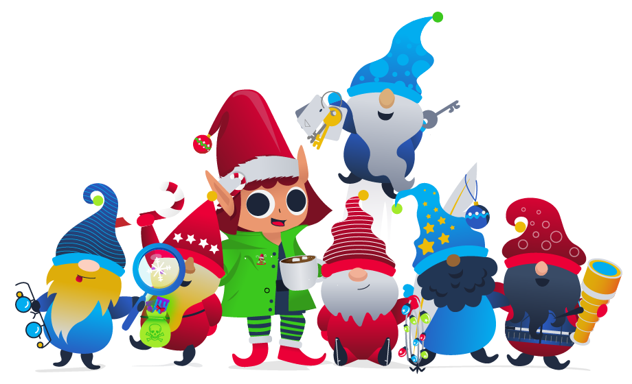

# Welcome to Advent of Cyber 2022

Get started with Cyber Security in 24 days! Learn the basics and complete a new, beginner-friendly security exercise every day leading up to Christmas. It’s an advent calendar but with security challenges instead of chocolate!

## Main Prizes 
We have over $40,000 worth of prizes!

In this event, points don’t matter, but the number of questions you answer does! For each question you get correct, you get a raffle ticket. We will randomly choose the winners on the 28th of December using everyone’s raffle tickets. The more questions you answer, the more chances you have of winning. Here are the prizes up for grabs:

- 6x Offensive Security Learn One Subscriptions ($12000)
- 1x TryHackMe will donate to your favourite charity ($2000)
- [5x Raspberry Pi 400 ($580)](https://www.raspberrypi.com/products/raspberry-pi-400/)
- [10x Airpods 2nd Gen Pro ($2500)](https://www.apple.com/uk/shop/product/MQD83ZM/A/airpods-pro)
- [6x DJI Drone ($3000)](https://www.currys.co.uk/products/dji-mini-2-drone-with-controller-space-grey-10216745.html)
- [10x GoPro ($3500)](https://gopro.com/en/us/shop/cameras/hero11-black/CHDHX-111-master.html)
- [10x CompTIA Security+ Vouchers ($2700)](https://uk-store.comptia.org/comptia-security-plus-exam-voucher/p/SEC-601-TSTV-20-C)
- [4x Remarkable 2 ($1200)](https://remarkable.com/store/remarkable-2)
- [10x Flipper Zero ($2100)](https://flipperzero.one/)
- [12x ASUS ZenBook 14 8GB RAM, 512GB SSD, Intel i5 ($8400)](https://www.amazon.co.uk/ASUS-Zenbook-UX425EA-i5-1135G7-Keyboard/dp/B09KZMCMWS)
- [10x Hak5 WiFi Pineapple ($1200)](https://shop.hak5.org/products/wifi-pineapple?variant=81044992)
- [10x Hak5 Rubber Ducky ($600)](https://shop.hak5.org/products/usb-rubber-ducky?variant=353378649)
- [15x TryHackMe Monthly Subscriptions ($150)](https://tryhackme.com/why-subscribe)
- [5x $20 TryHackMe Swag Vouchers ($100)](https://store.tryhackme.com/) 

Total Prize Pool Value: ~$40,100  
For Learn One Subscriptions, winners will be able to select their Offensive Security course.  

### View Giveaway Terms & Conditions  
1. By participating in the competition you agree to be bound by these terms and conditions.
2. Entrants must be over 16 years old on the date of their entry.
3. Winners will be contacted by email on December 28th 2022 (if not earlier). Winners need to respond by December 30th, otherwise, the prize value will go to a charity of TryHackMe choice.
4. Prizes are non-negotiable, non-transferable and non-refundable. No cash alternative is available. Where a Prize becomes unavailable for any reason, TryHackMe reserves the right to substitute that prize for a prize of equal or higher value.
5. Prizes are limited to one per person.
6. The Prize will be awarded to a randomly selected winner who has entered, using a random number generator. TryHackMe will not be held liable if the named prize becomes unavailable or cannot be fulfilled.
7. Employees of TryHackMe are not eligible to enter.
8. To the extent permitted by applicable law, TryHackMe shall not be liable under or in connection with these terms and conditions, the competition or any Prize for any indirect, special or consequential cost, expense, loss or damage suffered by a participant even if such cost, expense, loss or damage was reasonably foreseeable or might reasonably have been contemplated by the participant and TryHackMe and whether arising from breach of contract, tort, negligence, breach of statutory duty or otherwise.
9. The name, address, and email address of the winner must be provided to TryHackMe if requested and will be shared to enable fulfilment of the Prize.​
10. The winner’s username may be posted on the social media profiles of TryHackMe after the winner has been selected.
11. No purchase is necessary. Winners will not be required to pay to enter the competition.
12. If the Prize is not available in the winner's region, TryHackMe will donate the Prize value to a charity of the winners choice.

## Daily Prizes
Also, every day you complete a question, you get entered into another prize draw for the chance to win a mini-prize. Each day you can win one of two prizes: a 1-month TryHackMe subscription voucher or £15 swag voucher.  

The prize winners for each day will be announced on Mondays on Twitter, and they will be contacted via email.

## Certificate
Finally, if you complete every task in the event, you will earn a certificate of completion! Make sure your name is set in [your profile](https://tryhackme.com/profile).

## Videos Featuring
Each task released has a supporting video walkthrough. You can expect to see some of your favourite cyber security video creators and streamers guiding you through the challenges! This year we are featuring John Hammond, Cybersecurity Meg, Husky Hacks, SecurityNinja, Neal Bridges, InsiderPHD, and more!

## Topics Include
Topics that will be covered in the event are:

- Red Teaming
- Secure Coding
- Web Vulnerabilities
- Blue Teaming
- IoT Hacking

# Questions

> Read the above and checkout the sponsors

This task has no answer needed.

===============================================================================