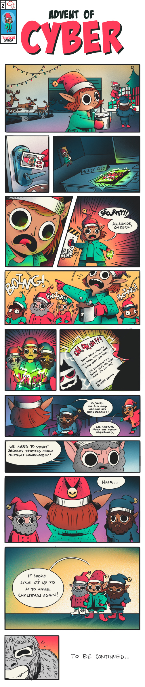

# [Nightmare Before Elfmas]

All exercises in Advent of Cyber follow a fun Christmas story. This year, the elf McSkidy needs your help to investigate a serious breach and test all remaining systems for security flaws.

Ah, the holiday season is close again! You might not feel it yet, but way up north, Elf McSkidy is already busy making sure you get your presents this year. As she walked through the yard of Santa’s workshop this morning, a cup of hot chocolate in her hands, everything seemed to be going great! Gifts getting wrapped, reindeer exercising on treadmills, and Santa’s sleigh being polished, the whole place was just teeming with elf activity.

When McSkidy entered the office, she immediately noticed that something was, in fact, out of order. A big, dark, half-frosted card was just lying on her desk! Who placed it there? How did they get into the locked Security Operations Centre (SOC) room? What did they want from Best Festival Company’s Chief Information Security Officer?!

Not having to think twice about it, McSkidy slammed the big “ALARM” button and yelled: “Security staff! All hands on deck. We’ve got an incident!”

She did not have to wait long - pretty quickly, the corridors of Best Festival Company’s offices saw a team of security specialists rushing to the SOC room. The McReds, ethical hackers at Santa’s command who find vulnerabilities before the bad guys do, came from the workshop. Elf Exploit McRed was first, then Elf Recon, and finally Elf Pivot skating on the icy floors. The McBlues rushed from the yard, where they were setting up monitoring, as they are responsible for Santa’s defences. McSkidy watched as Elf Log McBlue came running in, followed by Elf Admin and Elf Forensic, the gear strapped to their belts jingling loudly. Santa’s Security Team surrounded McSkidy, all holding their breaths. McSkidy picked up the evil-looking card from her desk with trembling hands, opened it, and they all saw what was inside:

    oH, oH, oH,
    Someone’s been naughty this year, leaving your shop open like that!
    We started with a little puzzle. Let’s see what more we can do!
        - Your Secret Santa

“But our shop wasn’t open! The door was locked when I entered. And you are monitoring the walls, right?” - McSkidy looked to her team for support. After a few clicks of the keyboard at the nearest computer, Admin McBlue announced: “It’s the gift shop website, McSkidy. It’s been defaced. There’s…. A puzzle? It says we’ll learn who did it if we solve it.”

The SOC room had just a few seconds of silence before the other elves started shouting:

“We need to investigate!”, “Check the logs!”, “Review monitoring!”, “Audit other systems!”, “Lock down the network!”

McSkidy held her hand up, waiting for the elves to calm down. “We’ve been through something like this last year. This year, we’re saving Christmas again!”

***See you in the daily tasks! We hope you can help McSkidy and the Team find out who is their mysterious adversary, investigate the incident, and secure their systems once again. Please note that the difficulty of challenges might vary each day, but they will always be easily approachable by beginners in cyber security. Have fun in Advent of Cyber!***

# Christmas Swag
Want to rep swag from your favorite cyber security training platform?  
We have a special edition Christmas Advent of Cyber t-shirt [availabl[e now](https://store.tryhackme.com/collections/all/products/advent-of-cyber-2022-limited-edition) - check our [swag store](https://store.tryhackme.com/) to order yours!

===============================================================================

# Questions

> The Christmas story is used within some of the tasks, so make sure you read the above.

    This task has no answer needed.

===============================================================================