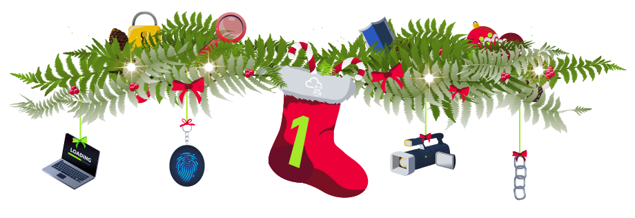
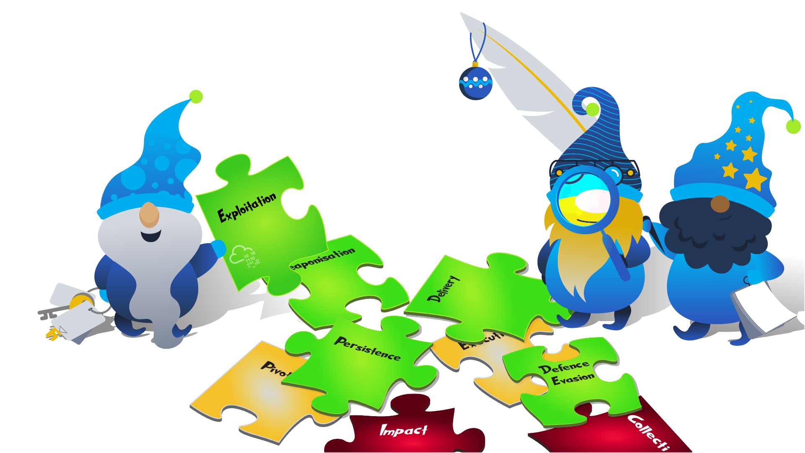
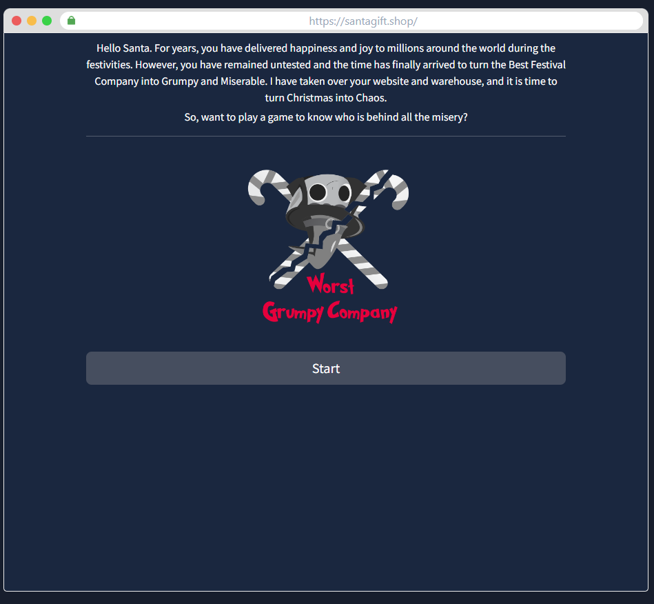
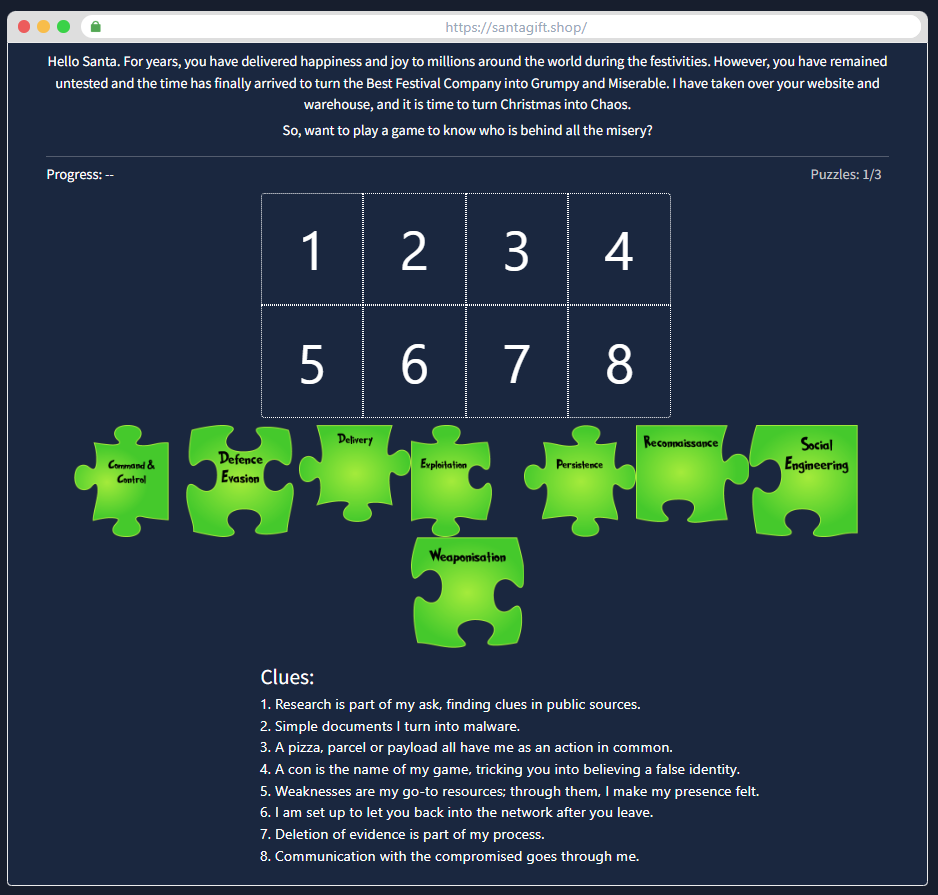
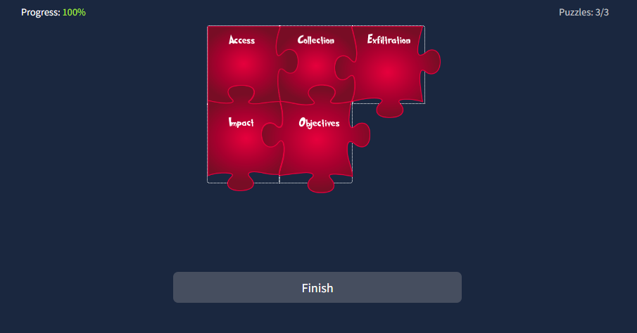
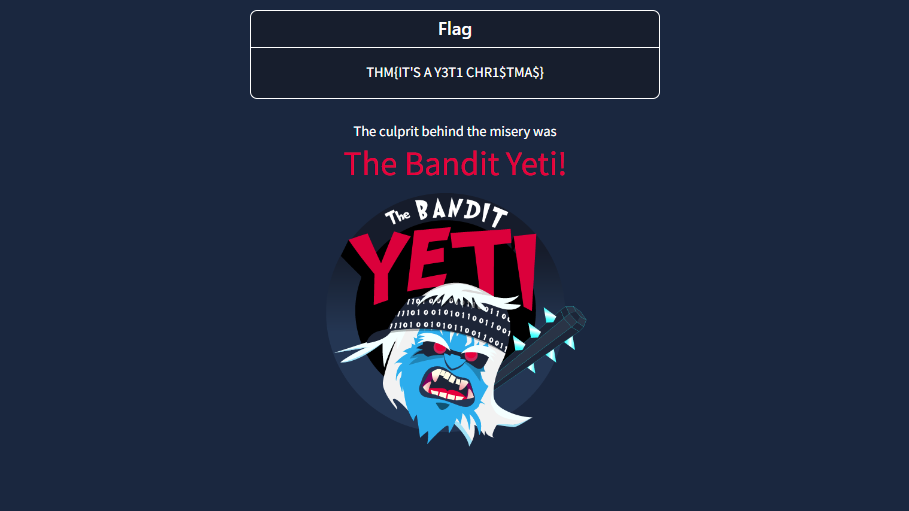

# The Story

The Advent of Cyber event is completely free! However, check out some of the reasons to subscribe: 

**John Hammond is kicking off the Advent of Cyber 2022 with a video premiere at 2pm BST! Once the video becomes available, you'll be able to see a sneak peek of the other tasks and a walkthrough of this day's challenge!**

Check out John Hammond's video walkthrough for day 1 [here](https://www.youtube.com/watch?v=G_2OcE8hxbA)!

# Best Festival Company Compromised
Someone is trying to stop Christmas this year and stop Santa from delivering gifts to children who were nice this year. The **Best Festival Company**’s website has been defaced, and children worldwide cannot send in their gift requests. There’s much work to be done to investigate the attack and test other systems! The attackers have left a puzzle for the Elves to solve and learn who their adversaries are. McSkidy looked at the puzzle and recognised some of the pieces as the phases of the **Unified Kill Chain**, a security framework used to understand attackers. She has reached out to you to assist them in recovering their website, identifying their attacker, and helping save Christmas.

# Security Frameworks
Organisations such as Santa’s Best Festival Company must adjust and improve their cybersecurity efforts to prevent data breaches. Security frameworks come into play to guide in setting up security programs and improve the security posture of the organisation.

**Security frameworks** are documented processes that define policies and procedures organisations should follow to establish and manage security controls. They are blueprints for identifying and managing the risks they may face and the weaknesses in place that may lead to an attack.

Frameworks help organisations remove the guesswork of securing their data and infrastructure by establishing processes and structures in a strategic plan. This will also help them achieve commercial and government regulatory requirements.

Let’s dive in and briefly look at the commonly used frameworks.

# NIST Cybersecurity Framework
The Cybersecurity Framework (CSF) was developed by the National Institute of Standards and Technology (NIST), and it provides detailed guidance for organisations to manage and reduce cybersecurity risk. The framework focuses on five essential functions: `Identify` -> `Protect` -> `Detect` -> `Respond` -> `Recover`. With these functions, the framework allows organisations to prioritise their cybersecurity investments and engage in continuous improvement towards a target cybersecurity profile.

# ISO 27000 Series
The International Organization of Standardization (ISO) develops a series of frameworks for different industries and sectors. The ISO 27001 and 27002 standards are commonly known for cybersecurity and outline the requirements and procedures for creating, implementing and managing an information security management system (ISMS). These standards can be used to assess an institution’s ability to meet set information security requirements through the application of risk management.

# MITRE ATT&CK Framework
Identifying adversary plans of attack can be challenging to embark on blindly. They can be understood through the behaviours, methods, tools and strategies established for an attack, commonly known as **Tactics, Techniques and Procedures** (TTPs). The MITRE ATT&CK framework is a knowledge base of TTPs, carefully curated and detailed to ensure security teams can identify attack patterns. The framework’s structure is similar to a periodic table, mapping techniques against phases of the attack chain and referencing system platforms exploited. 

This framework highlights the detailed approach it provides when looking at an attack. It brings together environment-specific cybersecurity information to provide cyber threat intelligence insights that help teams develop effective security programs for their organisations. Dive further into the framework by checking out the dedicated [MITRE room](https://tryhackme.com/room/mitre).

# Cyber Kill Chain
A key concept of this framework was adopted from the military with the terminology **kill chain**, which describes the structure of an attack and consists of target identification, decision and order to attack the target, and finally, target destruction. Developed by Lockheed Martin, the cyber kill chain describes the stages commonly followed by cyber attacks and security defenders can use the framework as part of intelligence-driven defence.

There are seven stages outlined by the Cyber Kill Chain, enhancing visibility and understanding of an adversary’s tactics, techniques and procedures.

Dive further into the kill chain by checking out the dedicated [Cyber Kill Chain room](https://tryhackme.com/room/cyberkillchainzmt).

# Unified Kill Chain

As established in our scenario, Santa’s team have been left with a clue on who might have attacked them and pointed out to the Unified Kill Chain (UKC). The Elf Blue Team begin their research.

The Unified Kill Chain can be described as the unification of the MITRE ATT&CK and Cyber Kill Chain frameworks. Published by Paul Pols in 2017 (and reviewed in 2022), the UKC provides a model to defend against cyber attacks from the adversary’s perspective. The UKC offers security teams a blueprint for analysing and comparing threat intelligence concerning the adversarial mode of working.

The Unified Kill Chain describes 18 phases of attack based on Tactics, Techniques and Procedures (TTPs). The individual phases can be combined to form overarching goals, such as gaining an initial foothold in a targeted network, navigating through the network to expand access and performing actions on critical assets. Santa’s security team would need to understand how these phases are put together from the attacker’s perspective.

## CYCLE 1: In
The main focus of this series of phases is for an attacker to gain access to a system or networked environment. Typically, cyber-attacks are initiated by an external attacker. The critical steps they would follow are: 

- **Reconnaissance**: The attacker performs research on the target using publicly available information.
- **Weaponisation**: Setting up the needed infrastructure to host the command and control centre (C2) is crucial in executing attacks.
- **Delivery**: Payloads are malicious instruments delivered to the target through numerous means, such as email phishing and supply chain attacks.
- **Social Engineering**: The attacker will trick their target into performing untrusted and unsafe action against the payload they just delivered, often making their message appear to come from a trusted in-house source.
- **Exploitation**: If the attacker finds an existing vulnerability, a software or hardware weakness, in the network assets, they may use this to trigger their payload.
- **Persistence**: The attacker will leave behind a fallback presence on the network or asset to make sure they have a point of access to their target.
- **Defence Evasion**: The attacker must remain anonymous throughout their exploits by disabling and avoiding any security defence mechanisms enabled, including deleting evidence of their presence.
- **Command & Control**: Remember the infrastructure that the attacker prepared? A communication channel between the - compromised system and the attacker’s infrastructure is established across the internet.

This phase may be considered a loop as the attacker may be forced to change tactics or modify techniques if one fails to provide an entrance into the network.

## CYCLE 2: Through
Under this phase, attackers will be interested in gaining more access and privileges to assets within the network.

The attacker may repeat this phase until the desired access is obtained.

- **Pivoting**: Remember the system that the attacker may use for persistence? This system will become the attack launchpad for other systems in the network.
- **Discovery**: The attacker will seek to gather as much information about the compromised system, such as available users and data. Alternatively, they may remotely discover vulnerabilities and assets within the network. This opens the way for the next phase.
- **Privilege Escalation**: Restricted access prevents the attacker from executing their mission. Therefore, they will seek higher privileges on the compromised systems by exploiting identified vulnerabilities or misconfigurations.
- **Execution**: With elevated privileges, malicious code may be downloaded and executed to extract sensitive information or cause further havoc on the system.
- **Credential Access**: Part of the extracted sensitive information would include login credentials stored in the hard disk or memory. This provides the attacker with more firepower for their attacks.
- **Lateral Movement**: Using the extracted credentials, the attacker may move around different systems or data storages within the network, for example, within a single department.

**NOTE:** A key element that one may think is missing is Access. This is not formally covered as a phase of the UKC, as it overlaps with other phases across the different levels, leading to the adversary achieving their goals for an attack.

## CYCLE 3: Out
The Confidentiality, Integrity and Availability (CIA) of assets or services are compromised during this phase. Money, fame or sabotage will drive attackers to undertake their reasons for executing their attacks, cause as much damage as possible and disappear without being detected.

- **Collection**: After finding the jackpot of data and information, the attacker will seek to aggregate all they need. By doing so, the assets’ confidentiality would be compromised entirely, especially when dealing with trade secrets and financial or personally identifiable information (PII) that is to be secured.
- **Exfiltration**: The attacker must get his loot out of the network. Various techniques may be used to ensure they have achieved their objectives without triggering suspicion.
- **Impact**: When compromising the availability or integrity of an asset or information, the attacker will use all the acquired privileges to manipulate, interrupt and sabotage. Imagine the reputation, financial and social damage an organisation would have to recover from.
- **Objectives**: Attackers may have other goals to achieve that may affect the social or technical landscape that their targets operate within. Defining and understanding these objectives tends to help security teams familiarise themselves with adversarial attack tools and conduct risk assessments to defend their assets.

# Saving The Best Festival Company

Having gone through the UKC with Santa’s security team, it is evident that better defensive strategies must be implemented to raise resilience against attacks.

Your task is to help the Elves solve a puzzle left for them to identify who is trying to stop Christmas. Click the **View Site** button at the top of the task to launch the static site in split view. You may have to open the static site on a new window and zoom in for a clearer view of the puzzle pieces.

===============================================================================

# Questions

> Who is the adversary that attacked Santa's network this year?

    Answer: The Bandit Yeti

> What's the flag that they left behind?

    Answer: THM{IT'S A Y3T1 CHR1$TMA$}

> Looking to learn more? Check out the rooms on [Unified Kill Chain](https://tryhackme.com/room/unifiedkillchain), [Cyber Kill Chain](https://tryhackme.com/room/cyberkillchainzmt), [MITRE](https://tryhackme.com/room/mitre), or the whole [Cyber Defence Frameworks](https://tryhackme.com/module/cyber-defence-frameworks) module! 

    This task has no answer needed.

===============================================================================

Upon "**View Site**", the new static site in split view will appear:

Press **Start** button to enter:

Objective of puzzle 1 is to fit the answer (jigsaw puzzle pieces) to the correct spot (1 to 8) using the clues given.  
The answer is as follows:

Click **next** to go to the next puzzle.

Similar as puzzle 1, match each answer (jigsaw puzzle pieces) to the correct spot (1 to 6) using the clues given.

Click **next** to go to the next puzzle.

Similar as previous 2 puzzles, match each answer (jigsaw puzzle pieces) to the correct spot (1 to 5) using the clues given.

Click **Finish** to reveal the answers.

