# The Story

Check out CMNatic's video walkthrough for Day 2 [here](https://www.youtube.com/watch?v=OXBJu5QKJmw)!

Santa’s Security Operations Center (SSOC) has noticed one of their web servers, [santagift.shop](http://santagift.shop/) has been hijacked by the Bandit Yeti APT group. Elf McBlue’s task is to analyse the log files captured from the web server to understand what is happening and track down the Bandit Yeti APT group.

# Learning Objectives
In today’s task, you will:

- Learn what log files are and why they’re useful
- Understand what valuable information log files can contain
- Understand some common locations these logs file can be found
- Use some basic Linux commands to start analysing log files for valuable information
- Help Elf McBlue track down the Bandit Yeti APT!

# What Are Log Files and Why Are They Useful
Log files are files that contain historical records of events and other data from an application. Some common examples of events that you may find in a log file:

- Login attempts or failures
- Traffic on a network
- Things (website URLs, files, etc.) that have been accessed
- Password changes
- Application errors (used in debugging)
- *and many, many more*

By making a historical record of events that have happened, log files are extremely important pieces of evidence when investigating:

- What has happened?
- When has it happened?
- Where has it happened?
- Who did it? Were they successful?
- What is the result of this action?

For example, a systems administrator may want to log the traffic happening on a network. We can use logging to answer the questions above in a given scenario:

A user has reportedly accessed inappropriate material on a University network. With logging in place, a systems administrator could determine the following:

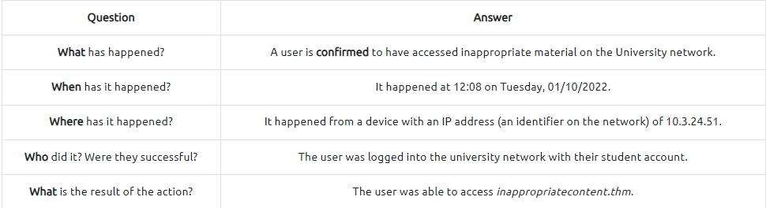

# What Does a Log File Look Like?a blue-team elf holding a magnifying glass
Log files come in all shapes and sizes. However, a useful log will contain at least some of the following attributes:

1. A timestamp of the event (I.e. Date & Time)
2. The name of the service that is generating the logfile (I.e. SSH is a remote device management protocol that allows a user to login into a system remotely)
3. The actual event the service logs (i.e., in the event of a failed authentication, what credentials were tried, and by whom? (IP address)).

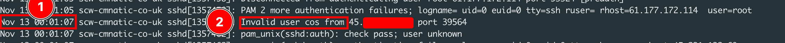

# Common Locations of Log Files

## Windows
Windows features an in-built application that allows us to access historical records of events that happen. The Event Viewer is illustrated in the picture below:

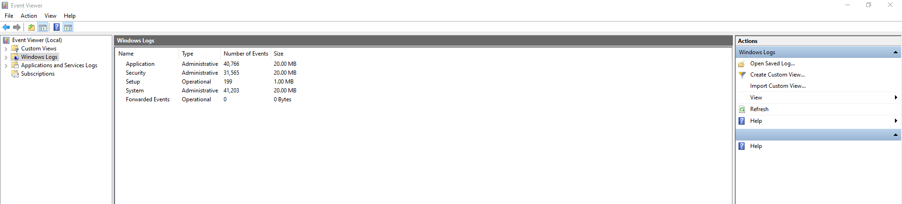

These events are usually categorised into the following:

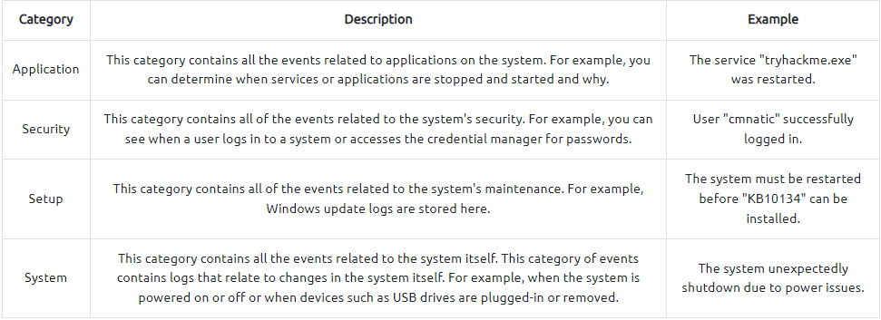

## Linux (Ubuntu/Debian)
On this flavour of Linux, operating system log files (and often software-specific such as apache2) are located within the /`var/log` directory. We can use the `ls` in the `/var/log` directory to list all the log files located on the system:

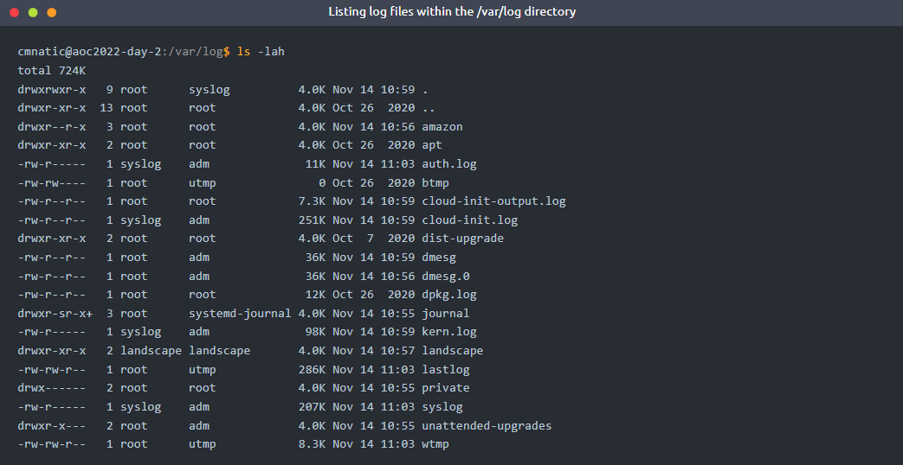

The following table highlights some important log files:

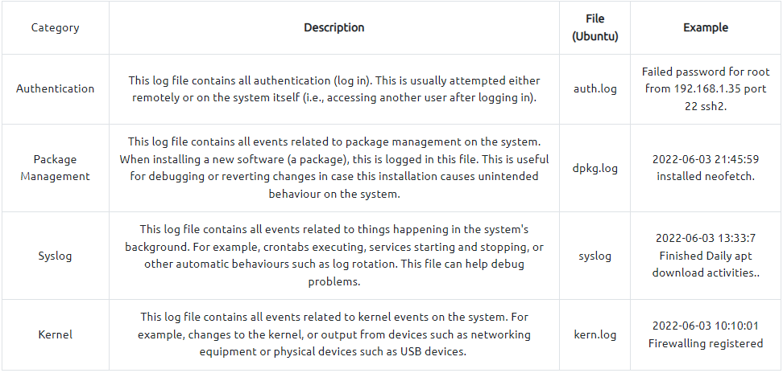

# Looking Through Log Files
Log files can quickly contain many events and hundreds, if not thousands, of entries. The difficulty in analysing log files is separating useful information from useless. Tools such as Splunk are software solutions known as Security Information and Event Management (SIEM) is dedicated to aggregating logs for analysis. Listed in the table below are some of the advantages and disadvantages of these platforms:

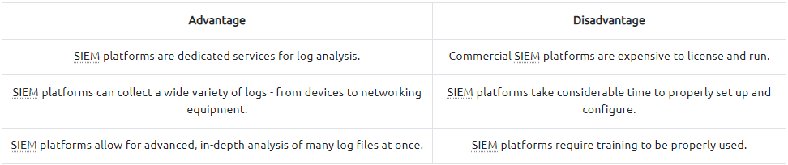

Luckily for us, most operating systems already come with a set of tools that allow us to search through log files. In this room, we will be using the `grep` command on Linux.

# Grep 101

*Grep* is a command dedicated to searching for a given text in a file. *Grep* takes a given input (a text or value) and searches the entire file for any text that matches our input. 

Before using `grep`, we have to find the location of the log file that we want to search for. By default, `grep` will use your current working directory. You can find out what your current working directory is by using `pwd`. For example, in the terminal below, we are in the working directory */home/cmnatic/aoc2022/day2/*:

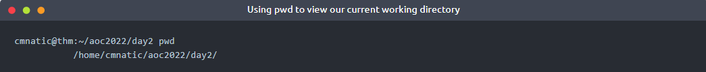

If we wish to change our current working directory, you can use `cd` followed by the new path you wish to change to. For example, `cd /my/path/here`. Once we've determined that we are in the correct directory, we can use `ls` to list the files and directories in our current working path. An example of this has been put into the terminal below:

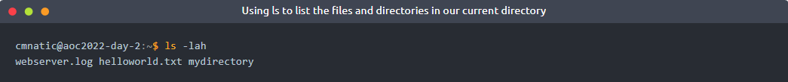

Now that we know where our log files are, we can begin to proceed with learning how to use `grep`. To use grep, we need to do three things:

- Call the command.
- Specify any options that we wish to use (this will later be explained), but for now, we can ignore this.
- Specify the location of the file we wish to search through (`grep` will first assume the file is in your current directory unless you tell it otherwise by providing the path to the file i.e. /path/to/our/logfile.log).

For example, in the terminal below, we are using `grep` to look through the log file for an IP address. The log file is located in our current working directory, so we do not need to provide a path to the log file - just the name of the log file.

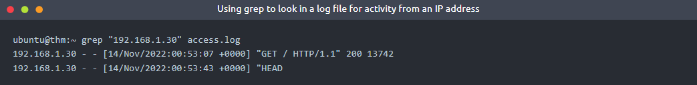

In the terminal above, we can see two entries in this log file (access.log) for the IP address "**192.168.1.30**". For reference, we've narrowed down two entries from a log file with 469 entries. Our life has already been made easier! Here are some ideas for things you may want to use grep to search a log file for:

- A name of a computer.
- A name of a file.
- A name of a user account.
- An IP address.
- A certain timestamp or date.

As previously mentioned, we can provide some options to `grep` to enable us to have more control over the results of grep. The table below contains some of the common options that you may wish to use with `grep`.

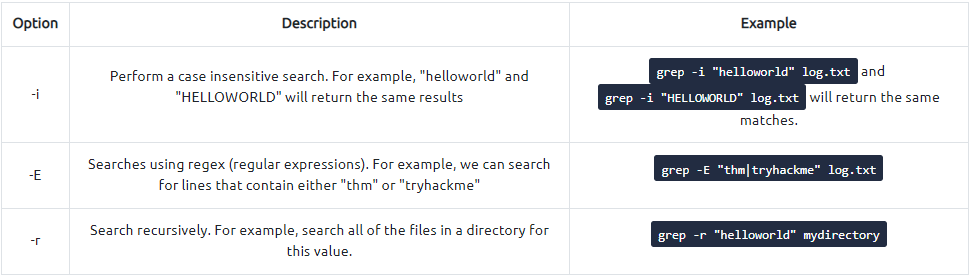

Further options available in grep can be searched within grep's manual page via `man grep`.

# Practical:

For today's task, you will need to deploy the machine attached to this task by pressing the green "Start Machine" button located at the top-right of this task. The machine should launch in a split-screen view. If it does not, you will need to press the blue "Show Split Screen" button near the top-right of this page.

If you wish, you can use the following credentials to access the machine using SSH (remember to connect to the VPN first):

- IP address: MACHINE_IP
- Username: elfmcblue
- Password: tryhackme!

Use the knowledge you have gained in today's task to help Elf McBlue track down the Bandit Yeti APT by answering the questions below.

===============================================================================

# Questions

> Ensure you are connected to the deployable machine in this task.

    This task has no answer needed.

> Use the `ls` command to list the files present in the current directory. How many log files are present?

    Answer: 2

> Elf McSkidy managed to capture the logs generated by the web server. What is the name of this log file?

    Answer: webserver.log

> Begin investigating the log file from question #3 to answer the following questions.

    This task has no answer needed.

> On what day was Santa's naughty and nice list stolen?

    Answer: friday

> What is the IP address of the attacker?

    Answer: 10.10.249.191

> What is the name of the important list that the attacker stole from Santa?

    Answer: santaslist.txt

> Look through the log files for the flag. The format of the flag is: THM{}

    Answer: THM{STOLENSANTASLIST}

> Interested in log analysis? We recommend the [Windows Event Logs][1] room or the [Endpoint Security Monitoring Module][2]. 

    This task has no answer needed.

[1]: https://tryhackme.com/room/windowseventlogs
[2]: https://tryhackme.com/module/endpoint-security-monitoring

===============================================================================

Click on "**Start Machine**" at the start of the task page and wait a while for the machine to start. If split view did not happen, click "**Split View**" at the top of the page:

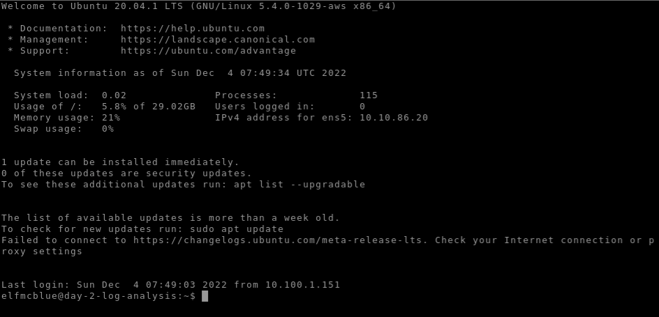

enter `ls` command to check number of log files present. Name of the log file generated by webserver is also one of the log files indicated.

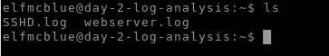

Look at the content of the log file by using the `cat` or `less` command:

`cat webserver.log`  
`less webserver.log`

Observe that all the logs are taken from 18/Nov/2022, which is a Friday.

Observe that most of the logs are returned `404` error code, indicating these are not valid URL endpoints. To narrow our searches, grep for code 200 to look for successful web responses. 

`grep " 200 " webserver.log` *- leaving spaces before and after 200 to avoid grepping 200 in URL endpoints as well.*

Observe that the IP address of the attacker and the name of the important list can be seen

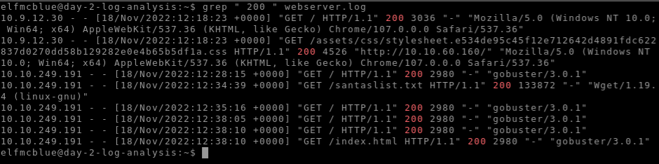

To get the flag, similarly use the `grep` command to look for **THM**, but this time look at all the log files, since the flag may reside in any of the log files provided.  

`grep "THM" *.log`

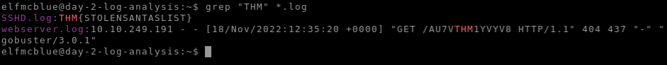