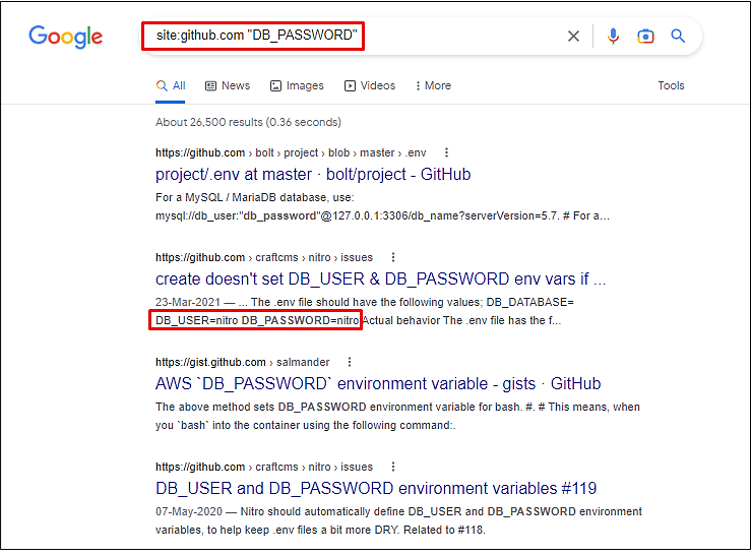
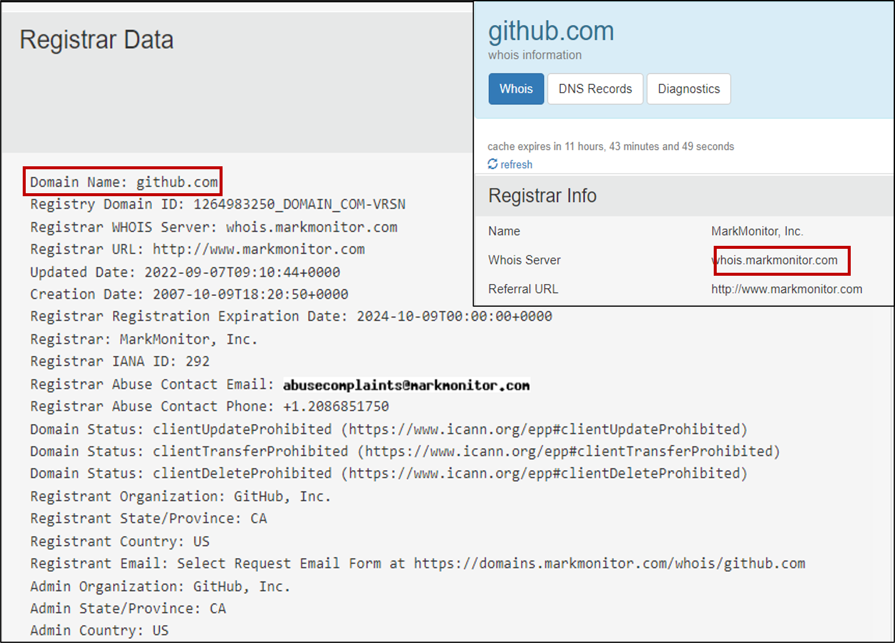
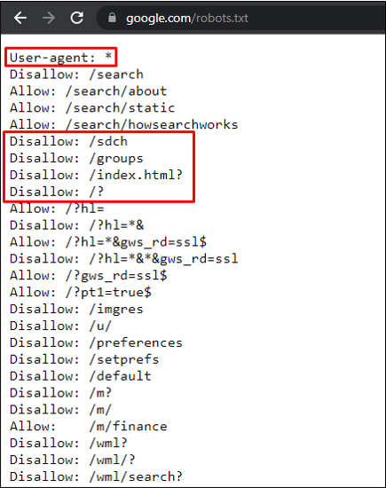
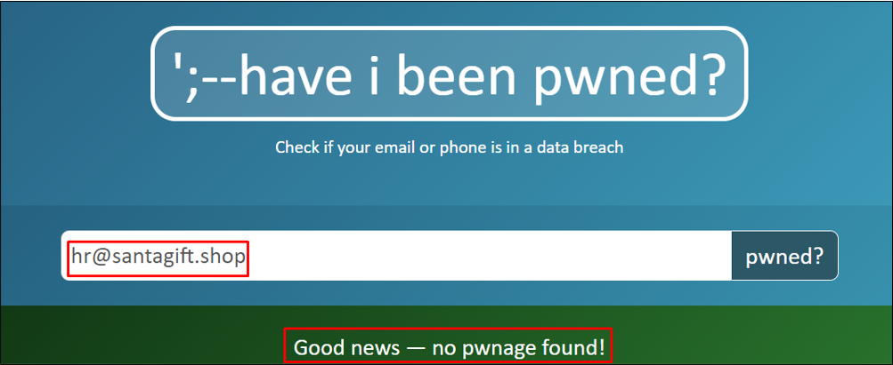
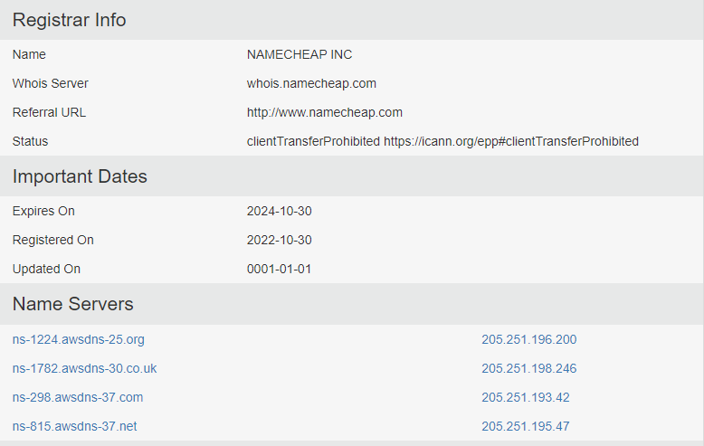
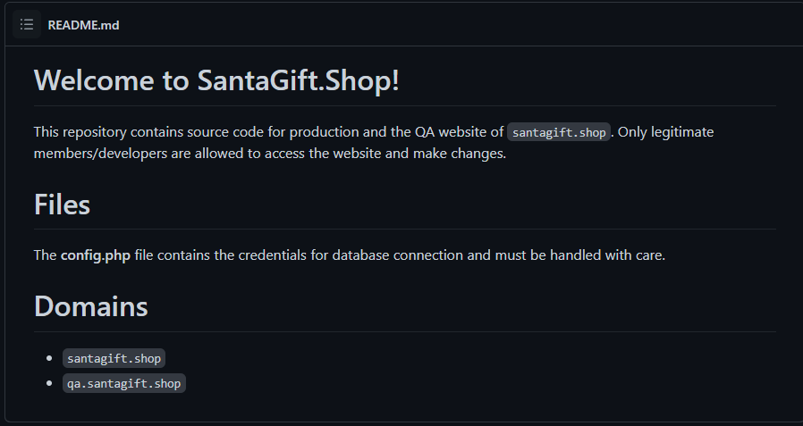

# The Story

Check out CyberSecMeg's video walkthrough for Day 3 [here](https://www.youtube.com/watch?v=j3sSJudp-H8)!

As the elves are trying to recover the compromised `santagift.shop` website, elf Recon McRed is trying to figure out how it was compromised in the first place. Can you help him in gathering open-source information against the website?  

# Learning Objectives
- What is OSINT, and what techniques can extract useful information against a website or target?
- Using dorks to find specific information on the Google search engine
- Extracting hidden directories through the Robots.txt file
- Domain owner information through WHOIS lookup
- Searching data from hacked databases
- Acquiring sensitive information from publicly available GitHub repositories

# What is OSINT
OSINT is gathering and analysing publicly available data for intelligence purposes, which includes information collected from the internet, mass media, specialist journals and research, photos, and geospatial information. The information can be accessed via the open internet (indexed by search engines), closed forums (not indexed by search engines) and even the deep and dark web. People tend to leave much information on the internet that is publicly available and later on results in impersonation, identity theft etc. 

# OSINT Techniques
## Google Dorks
Google Dorking involves using specialist search terms and advanced search operators to find results that are not usually displayed using regular search terms. You can use them to search specific file types, cached versions of a particular site, websites containing specific text etc.  Bad actors widely use it to locate website configuration files and loopholes left due to bad coding practices. Some of the widely used Google dorks are mentioned below:
- **inurl**: Searches for a specified text in all indexed URLs. For example, `inurl:hacking` will fetch all URLs containing the word "hacking".
- **filetype**: Searches for specified file extensions. For example, `filetype:pdf "hacking"` will bring all pdf files containing the word "hacking". 
- **site**: Searches all the indexed URLs for the specified domain. For example, `site:tryhackme.com` will bring all the indexed URLs from `tryhackme.com`.
- **cache**: Get the latest cached version by the Google search engine. For example, `cache:tryhackme.com`.

For example, you can use the `dork site:github.com "DB_PASSWORD"` to search only in **github.com** and look for the string **DB_PASSWORD** (possible database credentials). You can learn more about Google dorks through [this free room](https://tryhackme.com/room/googledorking).

Bingo! We have identified several repositories with database passwords.

## WHOIS Lookup
WHOIS database stores public domain information such as registrant (domain owner), administrative, billing and technical contacts in a centralised database. The database is publicly available for people to search against any domain and enables acquiring Personal Identifiable Information (PII) against a company, like an email address, mobile number etc., of technical contact. Bad actors can, later on, use the information for profiling, [spear phishing campaigns](https://www.trendmicro.com/vinfo/us/security/definition/spear-phishing) (targeting selected individuals) etc. Nowadays, registrars offer Domain Privacy options that allow users to keep their WHOIS information private from the general public and only accessible to certain entities like designated registrars. 

Multiple websites allow checking the WHOIS information against the website. For example, you can check WHOIS information on **github.com** through this [free website](https://who.is/whois/github.com). 

## Robots.txt
The robots.txt is a publicly accessible file created by the website administrator and intended for search engines to allow or disallow indexing of the website's URLs. All websites have their robots.txt file directly accessible through the domain's main URL. It is a kind of communication mechanism between websites and search engine crawlers. Since the file is publicly accessible, it doesn't mean anyone can edit or modify it. You can access robots.txt by simply appending robots.txt at the end of the website URL. For example, in the case of Google, we can access the robots.txt file by clicking this [URL](https://www.google.com/robots.txt).

We can see that Google has allowed and disallowed specific URLs for web scrapers and search engines. The disallow parameter helps bad actors to identify sensitive directories that can be manually accessed and exploited, like the admin panel, logs folder, etc. 

## Breached Database Search
Major social media and tech giants have suffered data breaches in the past.  As a result, the leaked data is publicly available and, most of the time contains PII like usernames, email addresses, mobile numbers and even passwords. Users may use the same password across all the websites; that enables bad actors to re-use the same password against a user on a different platform for a complete account takeover. Many web services offer to check if your email address or phone number is in a leaked database; [HaveIBeenPwned](https://haveibeenpwned.com/) is one of the free services. 

Elf Recon McRed tried to run all email addresses of the Santa gift shop website to identify any leakage, and gladly no data breach was found. 

## Searching GitHub Repos
GitHub is a renowned platform that allows developers to host their code through version control. A developer can create multiple repositories and set the privacy setting as well. A common flaw by developers is that the privacy of the repository is set as public, which means anyone can access it. These repositories contain complete source code and, most of the time, include passwords, access tokens, etc. 

McRed, the recon master, searched various terms on GitHub to find something useful like **SantaGiftShop**, **SantaGift**, **SantaShop** etc. Luckily, one of the terms worked, and he found the website's complete source code publicly available through OSINT.  

===============================================================================

# Questions

> What is the name of the Registrar for the domain santagift.shop?

    Answer: NAMECHEAP INC

> Find the website's source code (repository) on [github.com](https://github.com/) and open the file containing sensitive credentials. Can you find the flag?

    Answer: {THM_OSINT_WORKS}

> What is the name of the file containing passwords? 

    Answer: config.php

> What is the name of the QA server associated with the website?

    Answer: qa.santagift.shop

> What is the DB_PASSWORD that is being reused between the QA and PROD environments?

    Answer: S@nta2022

> Check out this [room](https://tryhackme.com/room/googledorking) if you'd like to learn more about Google Dorking! 

    This task has no answer needed.

===============================================================================

Open a new browser, go to the [WHOIS site](https://who.is) and search for `santagift.shop`:

Go to [github.com](https://github.com) and search for `SantaGiftShop`:

Click into the `muhammadthm/SantaGiftShop` repository and observe the README says the following:

Go to the **config.php** to find the flag.

The DB_PASSWORD can also be found in the **config.php**.

