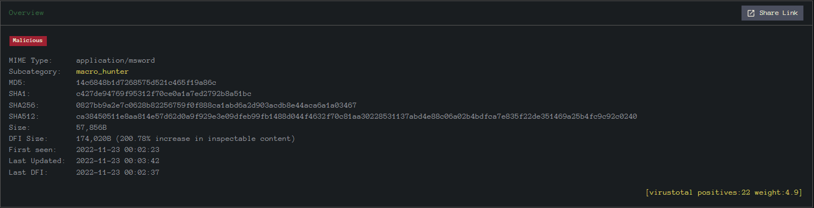

# The Story

Check out CyberSecMeg's video walkthrough for Day 4 [here](https://www.youtube.com/watch?v=dcGvnZ4JDHI)!

Elf McBlue found an email activity while analysing the log files. It looks like everything started with an email...

# Learning Objectives
- Learn what email analysis is and why it still matters.
- Learn the email header sections.
- Learn the essential questions to ask in email analysis.
- Learn how to use email header sections to evaluate an email.
- Learn to use additional tools to discover email attachments and conduct further analysis.
- Help the Elf team investigate the suspicious email received.

# What is Email Analysis?

Email analysis is the process of extracting the email header information to expose the email file details. The email header contains the technical details of the email like sender, recipient, path, return address and attachments. Usually, these details are enough to determine if there is something suspicious/abnormal in the email and decide on further actions on the email, like filtering/quarantining or delivering. This process can be done manually and with the help of tools.

There are two main concerns in email analysis.
- **Security issues**: Identifying suspicious/abnormal/malicious patterns in emails.
- **Performance issues**: Identifying delivery and delay issues in emails.

In this task, we will focus on security concerns on emails, a.k.a. phishing. Before focusing on the hands-on email analysis, you will need to be familiar with the terms "social engineering" and "phishing".

- **Social engineering**: Social engineering is the psychological manipulation of people into performing or divulging information by exploiting weaknesses in human nature. These "weaknesses" can be curiosity, jealousy, greed, kindness, and willingness to help someone.
- **Phishing**: Phishing is a sub-section of social engineering delivered through email to trick someone into either revealing personal information and credentials or executing malicious code on their computer.

Phishing emails will usually appear to come from a trusted source, whether that's a person or a business. They include content that tries to tempt or trick people into downloading software, opening attachments, or following links to a bogus website. You can find more information on phishing by completing the [phishing module][1].

# Authentication
Authentication refers to the process where a system validates your identity. The process starts with the user claiming a specific unique identity, such as claiming to be the owner of a particular username. Furthermore, the user needs to prove their identity. This process is usually achieved by one, or more, of the following:

1. **Something you know** refers, in general, to something you can memorize, such as a password or a PIN (Personal Identification Number).
2. **Something you have** refers to something you own, hardware or software, such as a security token, a mobile phone, or a key file. The security token is a physical device that displays a number that changes periodically.
3. **Something you are** refers to biometric authentication, such as when using a fingerprint reader or a retina scan.

Back to remote access services, we usually use passwords or private key files for authentication. Using a password is the default method for authentication and requires the least amount of steps to set up. Unfortunately, passwords are prone to a myriad of attacks.

# Does the Email Analysis Still Matter?

Yes! Various academic research and technical reports highlight that phishing attacks are still extremely common, effective and difficult to detect. It is also part of penetration testing and red teaming implementations (paid security assessments that examine organisational cybersecurity). Therefore, email analysis competency is still an important skill to have. Today, various tools and technologies ease and speed up email analysis. Still, a skilled analyst should know how to conduct a manual analysis when there is no budget for automated solutions. It is also a good skill for individuals and non-security/IT people!

**Important Note**: In-depth analysis requires an isolated environment to work. It is only suggested to download and upload the received emails and attachments if you are in the authorised team and have an isolated environment. Suppose you are outside the corresponding team or a regular user. In that case, you can evaluate the email header using the raw format and conduct the essential checks like the sender, recipient, spam score and server information. Remember that you have to inform the corresponding team afterwards.

# How to Analyse Emails?

Before learning how to conduct an email analysis, you need to know the structure of an email header. Let's quickly review the email header structure.

# Important Email Header Fields for Quick Analysis

Analysing multiple header fields can be confusing at first glance, but starting from the key points will make the analysis process slightly easier. A simple process of email analysis is shown below.

You'll also need an email header parser tool or configure a text editor to highlight and spot the email header's details easily. The difference between the raw and parsed views of the email header is shown below.

**Note**: The below example is demonstrated with the tool "Sublime Text". The tool is configured and ready for task usage in the given VM. 

You can use Sublime Text to view email files without opening and executing any of the linked attachments/commands. You can view the email file in the text editor using two approaches.

- Right-click on the sample and open it with Sublime Text.
- Open Sublime Text and drag & drop the sample into the text editor.

If your file has a **".eml"** or **".msg"** extension, the sublime text will automatically detect the structure and highlight the header fields for ease of readability. Note that if you are using a **".txt"** or any other extension, you will need manually select the highlighting format by using the button located at the lower right corner.

Text editors are helpful in analysis, but there are some tools that can help you to view the email details in a clearer format. In this task, we will use the "emlAnalyzer" tool to view the body of the email and analyse the attachments. The emlAnalyzer is a tool designed to parse email headers for a better view and analysis process. The tool is ready to use in the given VM. The tool can show the headers, body, embedded URLs, plaintext and HTML data, and attachments. The sample usage query is explained below.

Sample usage is shown below. Now use the given sample and execute the given command.

At this point, you should have completed the following checks.
- Sender and recipient controls
- Return path control
- Email server control
- Message-ID control
- Spam value control 
- Attachment control (Does the email contains any attachment?)

Additionally, you can use some Open Source Intelligence (OSINT) tools to check email reputation and enrich the findings. Visit the given site below and do a reputation check on the sender address and the address found in the return path.

## Tool: [https://emailrep.io/][2]

Here, if you find any suspicious URLs and IP addresses, consider using some OSINT tools for further investigation. While we will focus on using Virustotal and InQuest, having similar and alternative services in the analyst toolbox is worthwhile and advantageous.

After completing the mentioned initial checks, you can continue with body and attachment analysis. Now, let's focus on analysing the email body and attachments. The sample doesn't have URLs, only an attachment. You need to compute the value of the file to conduct file-based reputation checks and further your analysis. As shown below, you can use the sha256sum tool/utility to calculate the file's hash value. 

**Note**: Remember to navigate to the file's location before attempting to calculate the file's hash value.

Once you get the sum of the file, you can go for further analysis using the VirusTotal.

## Tool: [https://www.virustotal.com/gui/home/upload][3]

Now, visit the tool website and use the **SEARCH** option to conduct hash-based file reputation analysis. After receiving the results, you will have multiple sections to discover more about the hash and associated file. Sections are shown below.

- Search the hash value
- Click on the **BEHAVIOR** tab.
- Analyse the details.

After that, continue on reputation check on **InQuest** to enrich the gathered data.

## Tool: [https://labs.inquest.net/][4]

Now visit the tool website and use the **INDICATOR LOOKUP** option to conduct hash-based analysis.

- Search the hash value
- Click on the SHA256 hash value highlighted with yellow to view the detailed report.
- Analyse the file details.

After finishing the shown steps, you are finished with the initial email analysis. The next steps are creating a report of findings and informing the team members/manager in the appropriate format.

Now is the time to put what we've learned into practice. Click on the Start Machine button at the top of the task to launch the Virtual Machine. The machine will start in a split-screen view. In case the VM is not visible, use the blue Show Split View button at the top-right of the page. Now, back to elf McSkidy analysing the suspicious email that might have helped the Bandit Yeti infiltrate Santa's network.

**IMPORTANT NOTES:**
- **Given email sample contains a malicious attachment.**
- **Never directly interact with unknown email attachments outside of an isolated environment.**

[1]:https://tryhackme.com/module/phishing
[2]:https://emailrep.io/
[3]:https://www.virustotal.com/gui/home/upload
[4]:https://labs.inquest.net/
===============================================================================

# Questions

> What is the email address of the sender?

    Answer: chief.elf@santaclaus.thm

> What is the return address?

    Answer: murphy.evident@bandityeti.thm

> On whose behalf was the email sent?

    Answer: Chief Elf

> What is the X-spam score?

    Answer: 3

> What is hidden in the value of the Message-ID field?

    Answer: AoC2022_Email_Analysi

> Visit the email reputation check website provided in the task.
> What is the reputation result of the sender's email address?

    Answer: risky

> Check the attachments.
> What is the filename of the attachment?

    Answer: Division_of_labour-Load_share_plan.doc

> What is the hash value of the attachment?

    Answer: 0827bb9a2e7c0628b82256759f0f888ca1abd6a2d903acdb8e44aca6a1a03467

> Visit the Virus Total website and use the hash value to search.
> Navigate to the behaviour section.
> What is the second tactic marked in the Mitre ATT&CK section?

    Answer: Defense Evasion

> Visit the InQuest website and use the hash value to search.
> What is the subcategory of the file?

    Answer: macro_hunter

> If you want to learn more about phishing and analysing emails, check out the [Phishing][1] module! 

    This task has no answer needed.

===============================================================================

Launch the virtual machine.

From the split-view of the virtual machine, right click the `Urgent:.eml` in the Desktop and click `Open with Sublime Text`:

The sender email address is found under the `From:` tag.  
The return address is found under the `Return-Path` tag.  
The X-spam score if found under the `X-Pm-Spamscore` tag.

To get the hidden value of the `Message-ID` field, copy the base-64 text (without the `<>`) and open the terminal and enter the following:  
`echo "<paste base64 code here>" | base64 --decode`

Open browser, navigate to **https://emailrep.io/** and enter the sender's email address

Back at the sublime text, the filename can be found under `Content-Type` tag.

To get the hash value of the attachment, first open a terminal and use **emlAnalyser** to extract the attachment:  
`emlAnalyzer -i Desktop/Urgent\:.eml --text --extract-all`

Use the `sha256sum` command to derive the SHA256 hash value of the attachment:  
`sha256sum Desktop/eml_attachments/Division_of_labour-Load_share_plan.doc`

Open browser, navigate to **https://www.virustotal.com/gui/home/search** and search using the SHA256 hash value:

Click on **BEHAVIOUR** tab and look for the second tactic marked under **Mitre ATT&CK** section.

Open browser,navigate to **https://labs.inquest.net/** and search using the same SHA256 hash value:

Click the record and find the subcategory under the **Overview** tab:

