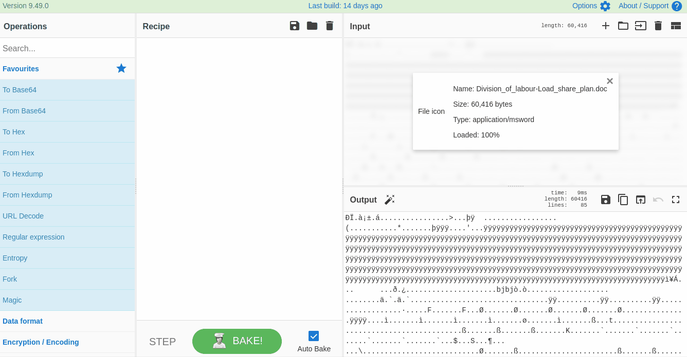
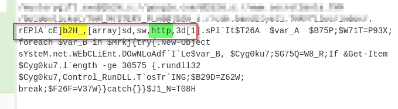
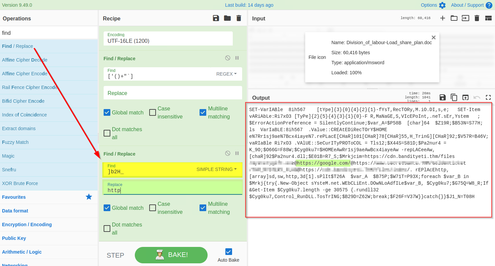

# The Story


Check out SecurityNinja's video walkthrough for Day 4 [here](https://www.youtube.com/watch?v=W4dZW5s2CeA)!

In the previous task, we learned that McSkidy was indeed a victim of a spearphishing campaign that also contained a suspicious-looking document **Division_of_labour-Load_share_plan.doc**. McSkidy accidentally opened the document, and it's still unknown what this document did in the background. McSkidy has called on the in-house expert **Forensic McBlue** to examine the malicious document and find the domains it redirects to. Malicious documents may contain a suspicious command to get executed when opened, an embedded malware as a dropper **(malware installer component)**, or may have some C2 domains to connect to.

# Learning Objectives
- What is CyberChef
- What are the capabilities of CyberChef
- How to leverage CyberChef to analyze a malicious document
- How to deobfuscate, filter and parse the data

# Lab Deployment

For today's task, you will need to deploy the machine attached to this task by pressing the green "**Start Machine**" button located at the top-right of this task. The machine should launch in a split-screen view. If it does not, you will need to press the blue "Show Split View" button near the top-right of this page.

# CyberChef Overview

CyberChef is a web-based application - used to slice, dice, encode, decode, parse and analyze data or files. The CyberChef layout is explained below. An offline version of cyberChef is bookmarked in Firefox on the machine attached to this task.


1. Add the text or file in panel 1.
2. Panel 2 contains various functions, also known as recipes that we use to encode, decode, parse, search or filter the data.
3. Drag the functions or recipes from Panel 2 into Panel 3 to create a recipe.
4. The output from the recipes is shown in panel 4.
5. Click on bake to run the functions added in Panel 3 in order. We can select AutoBake to automatically run the recipes as they are added.

# Using CyberChef for mal doc analysis
Let's utilize the functions, also known as recipes, from the left panel in CyberChef to analyze the malicious doc. Each step is explained below:

## 1) Add the File to CyberChef
Drag the invoice.doc file from the desktop to panel 1 as input, as shown below. Alternatively, the user can add the **Division_of_labour-Load_share_plan.doc** file by Open file as input icon in the top-right area of the CyberChef page.


## 2) Extract strings
Strings are ASCII and Unicode-printable sequences of characters within a file. We are interested in the strings embedded in the file that could lead us to suspicious domains. Use the strings function from the left panel to extract the strings by dragging it to panel 3 and selecting All printable chars as shown below:



If we examine the result, we can see some random strings of different lengths and some obfuscated strings. Narrow down the search to show the strings with a larger length. Keep increasing the minimum length until you remove all the noise and are only left with the meaningful string, as shown below:


## 3) Remove Pattern
Attackers often add random characters to obfuscate the actual value. If we examine, we can find some repeated characters `[ _ ]`. As these characters are common in different places, we can use regex (regular expressions) within the `Find / Replace` function to find and remove these repeated characters.

To use regex, we will put characters within the square brackets `[ ]` and use backslash `\` to escape characters. In this case, the final regex will be `[\[\]\n_]` where `\n` represents the Line feed, as shown below:


It's evident from the result that we are dealing with a PowerShell script, and it is using base64 Encoded string to hide the actual code.

## 4) Drop Bytes
To get access to the base64 string, we need to remove the extra bytes from the top. Let's use the `Drop bytes` function and keep increasing the number until the top bytes are removed.


## 5) Decode base64
Now we are only left with the base64 text. We will use the `From base64` function to decode this string, as shown below:


At this point, you should have completed the following checks.
- Sender and recipient controls
- Return path control
- Email server control
- Message-ID control
- Spam value control 
- Attachment control (Does the email contains any attachment?)

Additionally, you can use some Open Source Intelligence (OSINT) tools to check email reputation and enrich the findings. Visit the given site below and do a reputation check on the sender address and the address found in the return path.


## 6) Decode UTF-16
The base64 decoded result clearly indicates a PowerShell script which seems like an interesting finding. In general, the PowerShell scripts use the `Unicode UTF-16LE` encoding by default. We will be using the `Decode text` function to decode the result into UTF-16E, as shown below:


## 7) Find and Remove Common Patterns
Forensic McBlue observes various repeated characters  ```' ( ) + ' ` "``` within the output, which makes the result a bit messy.  
Let's use regex in the `Find/Replace` function again to remove these characters, as shown below. The final regex will be  ```['()+'"`]``` .


## 8) Find and Replace
If we examine the output, we will find various domains and some weird letters `]b2H_` before each domain reference. A replace function is also found below that seems to replace this `]b2H_` with `http`.



Let's use the `Find / Replace` function to replace `]b2H_` with `http` as shown below:



## 9) Extract URLs
The result clearly shows some domains, which is what we expected to find. We will use the `Extract URLs` function to extract the URLs from the result, as shown below:


## 10) Split URLs with @
The result shows that each domain is followed by the `@` character, which can be removed using the split function as shown below:


## 11) Defang URL
Great - We have finally extracted the URLs from the malicious document; it looks like the document was indeed malicious and was downloading a malicious program from a suspicious domain.

Before passing these domains to the SOC team for deep malware analysis, it is recommended to defang them to avoid accidental clicks. Defanging the URLs makes them unclickable. We will use `Defang URL` to do the task, as shown below:


Great work! 

It's time to share the URLs and the malicious document with the Malware Analysts.

===============================================================================

# Questions

> What is the version of CyberChef found in the attached VM?

    Answer: 9.49.0

> How many recipes were used to extract URLs from the malicious doc?

    Answer: 10

> We found a URL that was downloading a suspicious file; what is the name of that malware?

    Answer: mysterygift.exe

> What is the last defanged URL of the bandityeti domain found in the last step?

    Answer: hxxps[://]cdn[.]bandityeti[.]THM/files/index/

> What is the ticket found in one of the domains? (Format: Domain/<GOLDEN_FLAG>)

    Answer: THM_MYSTERY_FLAG

> If you liked the investigation today, you might also enjoy the [Security Information and Event Management][1] module! 

    This task has no answer needed.

[1]:https://tryhackme.com/module/security-information-event-management

===============================================================================

Launch the virtual machine.

From the split-view of the virtual machine, Open Firefox, and click on the `CyberChef` favorited link:


The version of the **Cyberchef** can be found on the top left of the page.

Work through the steps provided in the task above to get the number of recipes/steps neede to extract the URLs from the malicious doc


The suspicious file is found in the first URL of the **Cyberchef Output** ending with `.exe`.  
The last defanged URL is also found under the **Cyberchef Output**.  
The ticket is also found under the **Cyberchef Output**