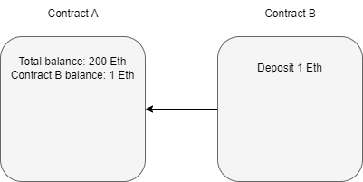
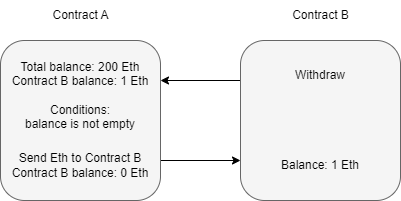
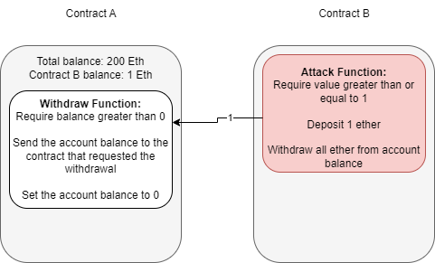
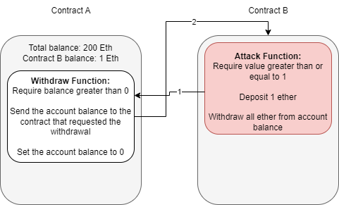
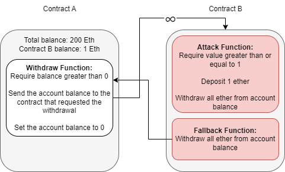
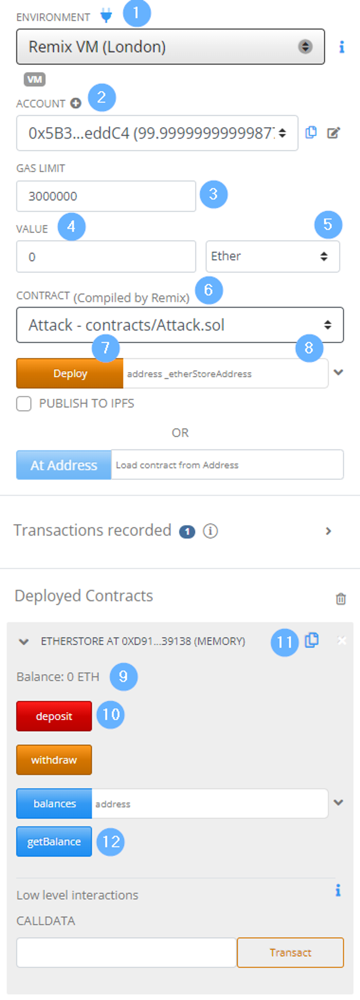

# The Story

Check out MWRSecurity's video walkthrough for Day 8 [here](https://www.youtube.com/watch?v=4Oydt3fNlgQ)!

After it was discovered that Best Festival Company was now on the blockchain and attempting to mint their cryptocurrency, they were quickly compromised. Best Festival Company lost all its currency in the exchange because of the attack. It is up to you as a red team operator to discover how the attacker exploited the contract and attempt to recreate the attack against the same target contract.

# Learning Objectives
- Explain what smart contracts are, how they relate to the blockchain, and why they are important.
- Understand how contracts are related, what they are built upon, and standard core functions.
- Understand and exploit a common smart contract vulnerability.

# What is a Blockchain?
One of the most recently innovated and discussed technologies is the blockchain and its impact on modern computing. While historically, it has been used as a financial technology, it's recently expanded into many other industries and applications. Informally, a blockchain acts as a database to store information in a specified format and is shared among members of a network with no one entity in control.

By definition, a blockchain is a digital database or ledger distributed among nodes of a peer-to-peer network. The blockchain is distributed among "peers" or members with no central servers, hence "decentralized." Due to its decentralized nature, each peer is expected to maintain the integrity of the blockchain. If one member of the network attempted to modify a blockchain maliciously, other members would compare it to their blockchain for integrity and determine if the whole network should express that change.

The core blockchain technology aims to be decentralized and maintain integrity; cryptography is employed to negotiate transactions and provide utility to the blockchain.

But what does this mean for security? If we ignore the core blockchain technology itself, which relies on cryptography, and instead focus on how data is transferred and negotiated, we may find the answer concerning. Throughout this task, we will continue to investigate the security of how information is communicated throughout the blockchain and observe real-world examples of practical applications of blockchain.

# Introduction to Smart Contracts
A majority of practical applications of blockchain rely on a technology known as a smart contract. Smart contracts are most commonly used as the backbone of DeFi applications (Decentralized Finance applications) to support a cryptocurrency on a blockchain. DeFi applications facilitate currency exchange between entities; a smart contract defines the details of the exchange. A smart contract is a program stored on a blockchain that runs when pre-determined conditions are met.

Smart contracts are very comparable to any other program created from a scripting language. Several languages, such as Solidity, Vyper, and Yul, have been developed to facilitate the creation of contracts. Smart contracts can even be developed using traditional programming languages such as Rust and JavaScript; at its core, smart contracts wait for conditions and execute actions, similar to traditional logic.

# Functionality of a Smart Contract
Building a smart contract may seem intimidating, but it greatly contrasts with core object-oriented programming concepts.

Before diving deeper into a contract's functionality, let's imagine a contract was a class. Depending on the fields or information stored in a class, you may want individual fields to be private, preventing access or modification unless conditions are met. A smart contract's fields or information should be private and only accessed or modified from functions defined in the contract. A contract commonly has several functions that act similarly to accessors and mutators, such as checking balance, depositing, and withdrawing currency.

Once a contract is deployed on a blockchain, another contract can then use its functions to call or execute the functions we just defined above.

If we controlled Contract A and Contract B wanted to first deposit 1 Ethereum, and then withdraw 1 Ethereum from Contract A,

Contract B calls the deposit function of Contract A.

Contract A authorizes the deposit after checking if any pre-determined conditions need to be met.

Contract B calls the withdraw function of Contract A.

Contract A authorizes the deposit if the pre-determined conditions for withdrawal are met.

Contract B can execute other functions after the Ether is sent from Contract A but before the function resolves.

# How do Vulnerabilities in Smart Contracts Occur?
Most smart contract vulnerabilities arise due to logic issues or poor exception handling. Most vulnerabilities arise in functions when conditions are insecurely implemented through the previously mentioned issues.

Let's take a step back to Contract A in the previous section. The conditions of the withdraw function are,
- Balance is greater than zero
- Send Etherium

At first glance, this may seem fine, but when is the amount to be sent subtracted from the balance? Referring back to the contract diagram, it is only ever deducted from the balance after the Etherium is sent. Is this an issue? The function should finish before the contract can process any other functions. But if you recall, a contract can consecutively make new calls to a function while an old function is still executing. An attacker can continuously attempt to call the withdraw function before it can clear the balance; this means that the pre-defined conditions will always be met. A developer must modify the function's logic to remove the balance before another call can be made or require stricter requirements to be met.

# The Re-entrancy Attack
In the above section, we informally introduced a common vulnerability known as re-entrancy. Reiterating what was covered above, re-entrancy occurs when a malicious contract uses a fallback function to continue depleting a contract's total balance due to flawed logic after an initial withdraw function occurs.

We have broken up the attack into diagrams similar to those previously seen to explain this better.

Assuming that contract B is the attacking contract and contract A is the storage contract. Contract B will execute a function to deposit, then withdraw at least one Ether. This process is required to initiate the withdraw function's response.

Note the difference between account balance and total balance in the above diagram. The storage contract separates balances per account and keeps each account's total balance combined. We are specifically targeting the total balance we do not own to exploit the contract.

At this point, contract B can either drop the response from the withdraw function or invoke a fallback function. A fallback function is a reserved function in Solidity that can appear once in a single contract. The function is executed when currency is sent with no other context or data, for example, what is happening in this example. The fallback function calls the withdraw function again, while the original call to the function was never fully resolved. Remember, the balance is never set back to zero, and the contract thinks of Ether as its total balance when sending it, not divided into each account, so it will continue to send currency beyond the account's balance until the total balance is zero.

Because the withdraw function sends Ether with no context or data, the fallback function will be called again, and thus an infinite loop can now occur.

Now that we have covered how this vulnerability occurs and how we can exploit it, let's put it to the test! We have provided you with the contract deployed by Best Festival Company in a safe and controlled environment that allows you to deploy contracts as if they were on a public blockchain.

# Practical Application
We have covered almost all of the background information needed to hit the ground running; let’s try our hand at actively exploiting a contract prone to a re-entrancy vulnerability. For this task, we will use [Remix IDE][1], which offers a safe and controlled environment to test and deploy contracts as if they were on a public blockchain.

Download the zip folder attached to this task, and open Remix in your preferred browser.

We have provided you with two files, one gathered from the Best Festival Company used to host their cryptocurrency balance and another malicious contract that will attempt to exploit the re-entrancy vulnerability.

Both contracts are legitimate Solidity contracts, but no need to worry if you need help understanding the program syntax behind each. They follow the same functionality and methodology we covered throughout this task, just translated to code!

## Getting Familiar with the Remix Environment

When you first open Remix, you want to draw your attention to the left side; there will be a file explorer, search, Solidity compiler, and deployment navigation button, respectively, from top to bottom. We will spend most of our time in the deploy & run transactions menu as it allows us to select from an environment, account, and contract and interact with contracts we have compiled.

## Importing the Necessary Contracts

To get started with the task, you will need to import the task files provided to you. To do this, navigate to file explorer → default_workspace → load a local file into the current workspace. From here, you can select the necessary `.sol` files to be imported. We have provided you with an `EtherStore.sol` and `Attack.sol` file that functions as we introduced in this section.

## Compiling the Contracts

The next step is to compile the contracts, navigate to the solidity compiler, and select `0.8.10+commitfcxxxxxx` from the dropdown compiler menu. Now you can compile the contract by pressing the compile button. You can ignore any warnings you may receive when compiling.

## Deploying and Interacting with Contracts

Now that we have the contracts compiled, they are ready to be deployed from the deployment tab. To the right(below) is a screenshot of the deployment tab and labels that we will use to reference menu elements as we move throughout the deployment process.

First, we must select a contract for deployment from the contract dropdown (label 6). We should deploy the EtherStore contract or target contract to begin. For deployment, you only need to press the deploy button (label 7).

We can now interact with the contract underneath the deployed contracts subsection. To test the contract, we can deposit Ether into the contract to be added to the total balance. To deposit, insert a value in the value textbox (label 4) and select the currency denomination at the dropdown under label 5. Once setup is complete, you can deposit by pressing the deposit button (label 10).

Note: when pressing the deposit button, this is a public function we are calling just as if it were another contract calling the function externally.

We’ve now successfully deployed our first contract and used it! You should see the Balance update (label 9).

Now that we have deployed our first contract, switch to a different account (dropdown label 2 and select a new account) and repeat the same process. This time you will be exploiting the original contract and should see the exploit actively occur! We have provided a summary of the steps to deploy and interact with a contract below.

Step 1: Select the contract you want to deploy from the contract dropdown menu under label 6.

Step 2: Deploy the contract by pressing the deploy button.

Note: you need to provide a reference to the contract you are targeting before deploying the attack contract. To accomplish this, copy the address for EtherStore from label 11 and paste the value in the textbox under label 8.

Step 3: Confirm the contract was deployed and the attack function can be seen from the deployed contracts subsection.

Step 4: Execute and/or interact with the contract’s function; note that most functions require some form of value input to execute a function properly.

If you get stuck, re-read through the discovery and explanation of the re-entrancy vulnerability. Recall that it must first deposit and withdraw before the fallback function can occur.

[1]:https://remix.ethereum.org/

===============================================================================

# Questions

> If not already completed, download the zip folder attached to this task, and open Remix in your preferred browser.

    This task has no answer needed.

> What flag is found after attacking the provided EtherStore Contract?

    Answer: flag{411_ur_37h_15_m1n3}

> Are you up for a little challenge to celebrate Day 8? Try your hand at these easy challenge rooms: [Quotient][2] and [Agent T][3]! 

    This task has no answer needed.

[2]:https://tryhackme.com/room/quotient
[3]:https://tryhackme.com/room/agentt

===============================================================================

Download the Task Files. Then open browser and navigate to [Remix IDE][1].

Follow the steps enumerated in the task provided above. You will get the flag once the steps are executed successfully:

