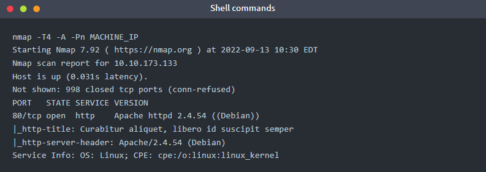
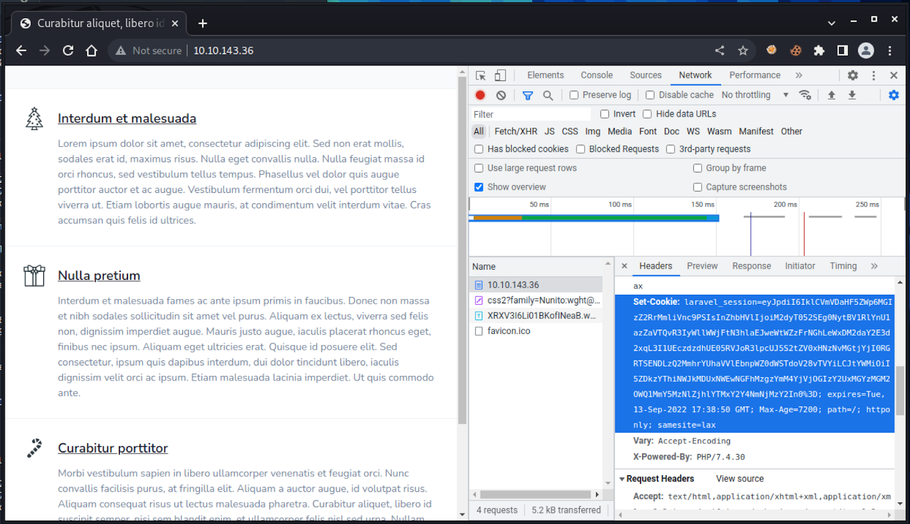
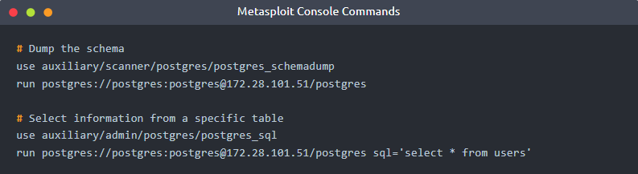

# The Story

Check out Alh4zr3d's video walkthrough for Day 9 [here](https://www.youtube.com/watch?v=mZqNP2fOLlk)!

**Today's task was created by the Metasploit Team at Rapid7.**

Because of the recent incident, Santa has asked his team to set up a new web application that runs on Docker. It's supposed to be much more secure than the previous one, but better safe than sorry, right? It's up to you, McSkidy, to show Santa that there may be hidden weaknesses before the bad guys find them!

# A note before you start
*Hey,*

*This task is a bit more complex than what you have seen so far in the event. We’ve ensured the task content has all the information you need. However, as there are many moving parts to getting it to work, it might prove challenging. Worry not! We have plenty of resources to help you out.*

*Linked above is a video walkthrough of the challenge, recorded by Alh4zr3d. It includes a thorough explanation, comprehensive instruction, valuable hints, analogies, and a complete guide to answering all the questions. Use it!*

*If you need more, [visit us on Discord][1]! We have a dedicated channel for Advent of Cyber, with staff on call and a very supportive community to help with all your questions and doubts.*

*You got this! See you tomorrow - Elf McSkidy will need your help more than ever.*

*With love,*

*The TryHackMe Team*

# Learning Objectives
- Using Metasploit modules and Meterpreter to compromise systems
- Network Pivoting
- Post exploitation

# Concepts
# What is Docker?
Docker is a way to package applications, and the associated dependencies into a single unit called an image. This image can then be shared and run as a container, either locally as a developer or remotely on a production server. Santa’s web application and database are running in Docker containers, but only the web application is directly available via an exposed port. A common way to tell if a compromised application is running in a Docker container is to verify the existence of a `/.dockerenv` file at the root directory of the filesystem.

# What is Metasploit?
Metasploit is a powerful penetration testing tool for gaining initial access to systems, performing post-exploitation, and pivoting to other applications and systems. Metasploit is free, open-source software owned by the US-based cybersecurity firm Rapid7.

# What is a Metasploit session?
After successfully exploiting a remote target with a Metasploit module, a session is often opened by default. These sessions are often Command Shells or Meterpreter sessions, which allow for executing commands against the target. It’s also possible to open up other session types in Metasploit, such as SSH or WinRM - which do not require payloads.

The common Metasploit console commands for viewing and manipulating sessions in Metasploit are:

# What is Meterpreter?
Meterpreter is an advanced payload that provides interactive access to a compromised system. Meterpreter supports running commands on a remote target, including uploading/downloading files and pivoting.

Meterpreter has multiple useful commands, such as the following:

Note that normal command shells do not support complex operations such as pivoting. In Metasploit’s console, you can upgrade the last opened Metasploit session to a Meterpreter session with `sessions -u -1`.

You can identify the opened session types with the `sessions` command. If you are currently interacting with a Meterpreter session, you must first `background` it. In the below example, the two session types are `shell cmd/unix` and `meterpreter x86/linux`:

# What is Pivoting?
Once an attacker gains initial entry into a system, the compromised machine can be used to send additional web traffic through - allowing previously inaccessible machines to be reached.

For example - an initial foothold could be gained through a web application running in a docker container or through an exposed port on a Windows machine. This system will become the attack launchpad for other systems in the network.

We can route network traffic through this compromised machine to run network scanning tools such as `nmap` or `arp` to find additional machines and services which were previously inaccessible to the pentester. This concept is called network pivoting.

# Launching The TryHackMe Kali Linux
For this task, you need to be using a Kali machine. TryHackMe host and provide a version of Kali Linux that is controllable in your browser. You can also connect with your own Kali Linux using OpenVPN. 

You can deploy the TryHackMe Kali Machine by following the steps below:

1. Scroll to the top of the page and press the drop-down arrow on the right of the blue "Start AttackBox" button:

2. Select "Use Kali Linux" from the drop-down:

3. Now press the "Start Kali" button to deploy the machine:

4. The machine will open in a split-screen view:

# Using Metasploit
If you are using the Web-based Kali machine or your own Kali machine, you can open Metasploit with the following `msfconsole` command:

After msfconsole is opened, there are multiple commands available:

After using a Metasploit module, you can view the options, set options, and run the module:

You can also directly set options from the `run` command:

# Using Meterpreter to pivot
Metasploit has an internal routing table that can be modified with the `route` command. This routing table determines where to send network traffic through, for instance, through a Meterpreter session. This way, we are using Meterpreter to pivot: sending traffic through to other machines on the network.

Note that Meterpreter has a separate route command, which is not the same as the top-level Metasploit prompt's route command described below. If you are currently interacting with a Meterpreter session, you must first `background` it.

Examples:

# Socks Proxy
A socks proxy is an intermediate server that supports relaying networking traffic between two machines. This tool allows you to implement the technique of pivoting. You can run a socks proxy either locally on a pentester’s machine via Metasploit, or directly on the compromised server. In Metasploit, this can be achieved with the `auxiliary/server/socks_proxy` module:

Tools such as `curl` support sending requests through a socks proxy server via the `--proxy` flag:

If the tool does not natively support an option for using a socks proxy, ProxyChains can intercept the tool’s request to open new network connections and route the request through a socks proxy instead. For instance, an example with Nmap:

# Challenge Walkthrough
After deploying the attached VM, run Nmap against the target:

After loading the web application in our browser at http://MACHINE_IP:80 (use Firefox on the Kali web-Machine) and inspecting the Network tab, we can see that the server responds with an HTTP Set-Cookie header indicating that the server is running Laravel - a common web application development framework:

The application may be vulnerable to a remote code execution exploit which impacts Laravel applications using debug mode with Laravel versions before 8.4.2, which use ignite as a developer dependency.

We can use Metasploit to verify if the application is vulnerable to this exploit.

Note: be sure to set the HttpClientTimeout=20, or the check may fail. In extreme situations where your connection is really slow/unstable, you may need a value higher than 20 seconds.

**Note: When using TryHackMe's Kali Web-Machine - you should use eth0 as the LHOST value (ATTACKER_IP), and not the VPN IP shown in the Kali Machine at the top-right corner (which is tun0).**

To find out what IP address you need to use, you can open up a new terminal and enter ip addr. The IP address you need will start with 10.x.x.x. Remember, you will either need to use eth0 or tun0, depending on whether or not you are using the TryHackMe Kali Web-Machine.

**Now that we’ve confirmed the vulnerability, let’s run the module to open a new session:**

The opened shell will be a basic `cmd/unix/reverse_bash` shell. We can see this by running the background command and viewing the currently active sessions:

If you are currently in a session - you can run the `background` command to go back to the top-level Metasploit prompt. To upgrade the most recently opened session to Meterpreter, use the `sessions -u -1` command. Metasploit will now show two sessions opened - one for the original shell session and another for the new Meterpreter session:

After interacting with the Meterpreter session with `sessions -i -1` and exploring the application, we can see there are database credentials available:

We can use Meterpreter to resolve this remote hostname to an IP address that we can use for attacking purposes:

As this is an internal IP address, it won’t be possible to send traffic to it directly. We can instead leverage the network pivoting support within msfconsole to reach the inaccessible host. To configure the global routing table in msfconsole, ensure you have run the `background` command from within a Meterpreter session:

We can also see, due to the presence of the `/.dockerenv` file, that we are in a docker container. By default, Docker chooses a hard-coded IP to represent the host machine. We will also add that to our routing table for later scanning:

We can print the routing table to verify the configuration settings:

With the previously discovered database credentials and the routing table configured, we can start to run Metasploit modules that target Postgres. Starting with a schema dump, followed by running queries to select information out of the database:

To further pivot through the private network, we can create a socks proxy within Metasploit:

This will expose a port on the attacker machine that can be used to run other network tools through, such as `curl` or `proxychains`

With the host scanned, we can see that port 22 is open on the host machine. It also is possible that Santa has re-used his password, and it’s possible to SSH into the host machine from the Docker container to grab the flag:

[1]:https://discord.gg/tryhackme

===============================================================================

# Questions

> Deploy the attached VM, and wait a few minutes. What ports are open?

    Answer: 80

> What framework is the web application developed with?

    Answer: Laravel

> What CVE is the application vulnerable to?

    Answer: CVE-2021-3129

> What command can be used to upgrade the last opened session to a Meterpreter session?

    Answer: sessions -u -1

> What file indicates a session has been opened within a Docker container?

    Answer: /.dockerenv

> What file often contains useful credentials for web applications?

    Answer: .env

> What database table contains useful credentials?

    Answer: users

> What is Santa's password?

    Answer: p4$$w0rd

> What ports are open on the host machine?

    Answer: 22,80

> What is the root flag?

    Answer: THM{47C61A0FA8738BA77308A8A600F88E4B}

> Day 9 is done! You might want to take a well-deserved rest now. If this challenge was right up your alley, though, we think you might enjoy the [Compromising Active Directory][2] module! 

    This task has no answer needed.

[2]:https://tryhackme.com/module/hacking-active-directory

===============================================================================

The Challenge walkthrough is provided as part of the task above.

To begin the walkthrough, just deploy the virtual machine, and launch the kali-linux attack-box machine (or use your own Kali machine with THM VPN enabled).

### Key Screenshot from the Challenge Walkthrough below.

`/var/www/.env` content:

f

Credentials from **users** table in Postgres database:

SSH login with root to obtain flag:

