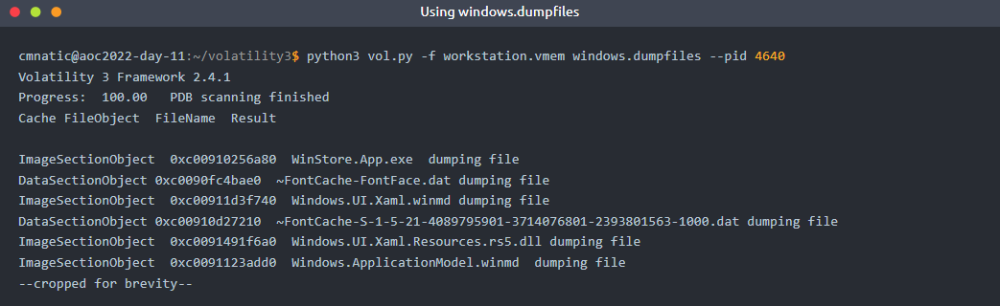
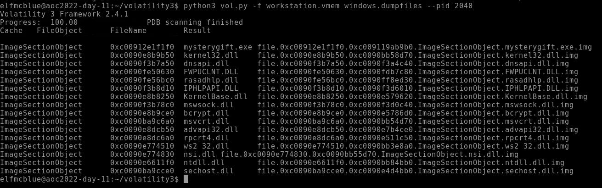

# The Story

Check out SecurityNinja's video walkthrough for Day 11 [here](https://www.youtube.com/watch?v=RsJR2z_agiY)!

The elves in Santa's Security Operations Centre (SSOC) are hard at work checking their monitoring dashboards when Elf McDave, one of the workshop employees, knocks on the door. The elf says, "*I've just clicked on something and now my workstation is behaving in all kinds of weird ways. Can you take a look?*".

Elf McSkidy tasks you, Elf McBlue, to investigate the workstation. Running down to the workshop floor, you see a command prompt running some code. Uh oh! This is not good. You immediately create a memory dump of the workstation and place this dump onto your employee-issued USB stick, returning to the SSOC for further analysis.

*You plug the USB into your workstation and begin your investigation.*

# What is Memory Forensics?

Memory forensics is the analysis of the volatile memory that is in use when a computer is powered on. Computers use dedicated storage devices called Random Access Memory (RAM) to remember what is being performed on the computer at the time. RAM is extremely quick and is the preferred method of storing and accessing data. However, it is limited compared to storage devices such as hard drives. This type of data is volatile because it will be deleted when the computer is powered off. RAM stores data such as your clipboard or unsaved files. 

We can analyse a computer's memory to see what applications (processes), what network connections were being made, and many more useful pieces of information. For example, we can analyse the memory of a computer infected with malware to see what the malware was doing at the time.

Let's think about cooking. You normally store all of your food in the fridge - a hard drive is this fridge. When you are cooking, you will store ingredients on the kitchen counter so that you can quickly access them, but the kitchen counter (RAM) is much smaller than a fridge (hard drive)

# Why is Memory Forensics Useful?

Memory forensics is an extremely important element when investigating a computer. A memory dump is a full capture of what was happening on the Computer at the time, for example, network connections or things running in the background. Most of the time, malicious code attempts to hide from the user. However, it cannot hide from memory.

We can use this capture of the memory for analysis at a later date, especially as the memory on the computer will eventually be lost (if, for example, we power off the computer to prevent malware from spreading). By analysing the memory, we can discover exactly what the malware was doing, who it was contacting, and such forth.

# An Introduction to Processes

At the simplest, a process is a running program. For example, a process is created when running an instance of notepad. You can have multiple processes for an application (for example, running three instances of notepad will create three processes). This is important to know because being able to determine what processes were running on the computer will tell us what applications were running at the time of the capture.

On Windows, we can use Task Manager(*pictured below*) to view and manage the processes running on the computer.

On a computer, processes are usually categorised into two groups:

# Introducing Volatility
Volatility is an open-source memory forensics toolkit written in Python. Volatility allows us to analyse memory dumps taken from Windows, Linux and Mac OS devices and is an extremely popular tool in memory forensics. For example, Volatility allows us to:
- List all processes that were running on the device at the time of the capture
- List active and closed network connections
- Use Yara rules to search for indicators of malware
- Retrieve hashed passwords, clipboard contents, and contents of the command prompt
- And much, much more!

Once Volatility and its requirements (i.e. Python) are installed, Volatility can be run using `python3 vol.py`. The terminal below displays Volatility's help menu:

Today's task will cover Volatility 3, which was initially released in 2020 to replace the deprecated Volatility 2 framework.  Volatility requires  a few arguments to run:
- Calling the Volatility tool via `python3 vol.py`
- Any options such as the name and location of the memory dump
- The action you want to perform (I.e. what plugins you want to use - we'll come onto these shortly!)

Some common options and examples that you may wish to provide to Volatility are located in the table below:

And finally, now we need to decide what we want to analyse the image for. Volatility uses plugins to perform analysis, such as:
- Listing processes
- Listing network connections
- Listing contents of the clipboard, notepad, or command prompt
- And much more! If you're curious, you can read the documentation [here][1]

In this task, we are going to use Volatility to:
1. See what Operating System the memory dump is from
2. See what processes were running at the time of capture
3. See what connections were being made at the time of capture

# Using Volatility to Analyse an Image

Before proceeding with our analysis, we need to confirm the Operating System of the device that the memory has been captured from. We need to confirm this because it will determine what plugins we can use in our investigation.

First, let's use the `imageinfo` plugin to analyse our memory dump file to determine the Operating System. To do this, we need to use the following command (remembering to include our memory dump by using the `-f` option): `python3 vol.py -f workstation.vmem windows.info`.

**Note:** *This can sometimes take a couple of minutes, depending on the size of the memory dump and the hardware of the system running the scan.*

Great! We can see that Volatility has confirmed that the Operating System is Windows. With this information, we now know we need to use the Windows sub-set of plugins with Volatility. The plugins that are going to be used in today's task are detailed in the table below:

*Please note that this is not all of the possible plugins. An extensive list of the Windows sub-set of plugins can be found [here][2].*

# Showing These Plugins in Use

## windows.pslist
`python3 vol.py -f workstation.vmem windows.pslist`

## windows.psscan
`python3 vol.py -f workstation.vmem windows.psscan`

## windows.dumpfiles
`python3 vol.py -f workstation.vmem windows.dumpfiles`

To access the memory dump, you will need to deploy the machine attached to this task by pressing the green "Start Machine" button located at the top-right of this task. The machine should launch in a split-screen view. If it does not, you will need to press the blue "Show Split Screen" button near the top-right of this page. 

***Volatility and the memory file (named workstation.vmem) is located in /home/elfmcblue/volatility3.***

[1]:https://volatility3.readthedocs.io/en/latest/volatility3.plugins.html
[2]:https://volatility3.readthedocs.io/en/stable/volatility3.plugins.windows.html

===============================================================================

# Questions

> What is the Windows version number that the memory image captured?  
> *Note: this initial scan may take up towards 10 minutes to complete. Why not grab some water or stretch your legs?*

    Answer: 10

> What is the name of the binary/gift that secret Santa left?

    Answer: mysterygift.exe

> What is the Process ID (PID) of this binary?

    Answer: 2040

> Dump the contents of this binary. How many files are dumped?

    Answer: 16

> If you want to learn more about Volatility, please check out a dedicated room [here][3]. For more content on forensics, we have a full [Digital Forensics and Incident Response][4] module for you! 

    This task has no answer needed.

[3]:https://tryhackme.com/room/volatility
[4]:https://tryhackme.com/module/digital-forensics-and-incident-response

===============================================================================

The Challenge walkthrough is provided as part of the task above.

To begin the walkthrough, just deploy the virtual machine, and locate the Volatility and memory:  
***Volatility and the memory file (named workstation.vmem) is located in /home/elfmcblue/volatility3.***

### Key points from the Challenge Walkthrough below.

Analyse memory dump using following command:  
`python3 volatility3 -f workstation.vmem windows.info

Find all the running processes running on system at time of memory dump capture to find a suspicious process running:  
`python3 vol.py -f workstation.vmem windows.pslist`

Run the following command to dump the contents of the suspicious binary:  
`python3 vol.py -f workstation.vmem windows.dumpfiles --pid 2040`

