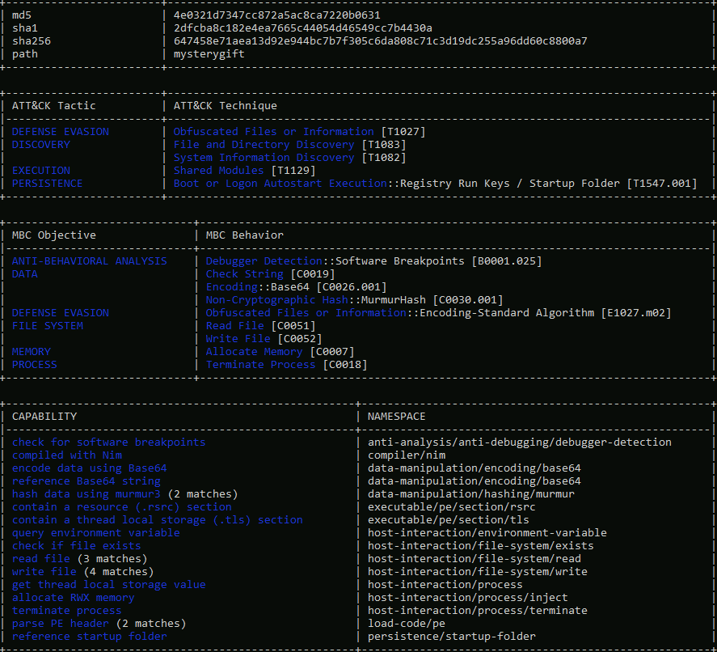

# The Story

Check out HuskyHack's video walkthrough for Day 12 [here](https://www.youtube.com/watch?v=kdQZPLRnr3g)!

The malicious document attached to the phishing email was confirmed to have been executed. Aside from the fact that rogue connections were observed, we know little about what it does.

Our in-house expert **Forensic McBlue** confirmed that the malicious document spawned another suspicious binary. Pivoting from that, he dumped it from memory for this task to be further analysed via Malware Analysis.

# Learning Objectives

- Learn the fundamentals of analysing malware samples without relying on automated sandbox scanners.
- Learn and understand typical malware behaviour and its importance in the incident investigation pipeline.

# Key Malware Behaviours

Before touching the malware sample for this task, we need to briefly introduce common malware behaviours to have a good perspective on what to expect in handling malware samples. 

A prominent word in cybersecurity, **malware** is software created to harm a computer or an entire network. Threat actors develop malware to achieve specific goals, such as infiltrating networks, breaching sensitive data, or disrupting operational services.

If you were to inspect several malware samples in the wild, a typical pattern arises, making analysing other samples easier with experience. Knowing these common behaviours gives us an idea of what to look for on the defensive side, such as:
- **Network connections** - Malware tends to establish either external network connections or internal connections. External connections allow remote access or for downloading staged payloads from a threat actors' infrastructure. Meanwhile, internal connections allow for lateral movement, a technique used to extend access to other hosts or applications within the network.
- **Registry key modifications** - Malware typically uses registry keys to establish persistence, a technique used by threat actors to discreetly maintain long-term access to a system despite disruptions. A good example is Registry Run Keys, which allows binaries to be automatically executed when a user logs in or the machine boots up.
- **File manipulations** -  Malware also tends to download (one of the common reasons to establish network connections) or create new files needed for its successful execution.

Given this knowledge, we can expect the possible behaviour of malware during an investigation.

# Dangers of Analysing Malware Samples

**WARNING: Handling a malware sample is dangerous. Always consider precautions while analysing it. **

With this, here are some helpful tips when handling live malware:

- Always assume that malware samples will infect your device; hence executing it is not always the first and only step in analysing it.
- Only run the malware sample in a controlled environment that prevents potential compromise of unwanted assets.
- It is always recommended to have your **sandbox**, which allows you have a worry-free execution of malware samples.

A **sandbox** is a controlled test environment that mimics a legitimate end-user working environment. It gives analysts a safe environment to execute malware samples and learn their behaviour. Lastly, having a ready sandbox prevents analysts from running malware samples in their workstations, which is highly dangerous and impractical for the possibility of unwanted impact.

In a typical setup, sandboxes also provide automated analysis at the disposal of Security Analysts to determine if a binary from a set of malware samples requires further manual investigation.

For this task, you may start the attached FlareVM instance by clicking on the Start Machine button. This VM will serve as your **sandbox**. However, do not expect this machine to provide an automated analysis since we will assist Forensic McBlue in conducting manual analysis. 

Note: If the VM is not visible, use the blue Show Split View button at the top-right of the page.

You may use the following credentials for alternative access via Remote Desktop (RDP):
- Machine IP: `MACHINE_IP`
- User: `administrator`
- Pass: `letmein123!`

# Static and Dynamic Analysis

We have understood the prerequisites needed to handle the malware safely from the previous section. Now, let's have a quick refresher on the two methods of malware analysis.

**Static Analysis** is a way of analysing a malware sample without executing the code. This method mainly focuses on profiling the binary with its readable information, such as its properties, program flow and strings. Given the limitation of not executing it, sometimes this method gives insufficient information, which is why we resort to Dynamic Analysis.   

Meanwhile, **Dynamic Analysis** mainly focuses on understanding the malware by executing it in a safe environment, such as a Sandbox. By doing this, you will see the malware live in action, its exact behaviour, and how it infects the environment.

# Profiling Executables through Static Analysis

As discussed above, before popping the malware sample in `$Desktop\Malware` Sample directory, let's conduct a Static Analysis for the **mysterygift** binary.

For this exercise, we will mainly use the following tools: **Detect It Easy** and **CAPA**.

## Detect It Easy

Right-click the sample and execute **Detect It Easy (DIE)**. This tool provides information about the file, such as its architecture, significant headers, packer used, and strings. In this task, we will only utilise the basic functionalities of Detect It Easy to gain the basic information needed to analyse the binary. If you want to learn more about this tool, you may refer to this [link][1].

Upon opening, we will immediately discover the binary's architecture, and the executable packer used.

Packing malware is a common technique used by malware developers to compress, obfuscate or encrypt the binary. With this, contents such as significant strings and headers will not be immediately visible to Static Analysis Tools.

You may test this information by doing the following:
- View the strings from Detect It Easy, which shows an overwhelming number of strings that are not that significant for investigation.
- Note: Strings are pieces of text inside a binary, often containing information such as IP addresses, URLs, or file names used by the malicious program.  

- Run **CAPA**, which shows that the binary mostly hides its logic and analysis is affected due to a packer.

## CAPA

- **CAPA** detects capabilities in executable files. May it be for the installation of a service, invocation of network connections, registry modifications and such.

To start playing with CAPA, fire up the command prompt located in the taskbar and navigate to the Malware Sample directory, as shown below.

Given the CAPA output, we have discovered that the malware sample is packed. You may have also seen previously from **Detect It Easy** that the binary is packed by UPX.

So now, let's unpack the binary using **UPX** and re-analyse the binaries using CAPA.

You may observe that CAPA now has provided important information about the malware sample.

Note: We have executed `del mysterygift.viv` to delete the cached results of the first CAPA execution. By deleting the viv file, CAPA re-analyses the binary with accurate results.

With prior, yet limited, knowledge about the malware sample, let's investigate more by doing a dynamic analysis!

# Deep-dive into Dynamic Malware Analysis

You may have observed that we cannot execute the binary after double-clicking it, as its file extension is not `.exe`.

Before renaming and executing the binary, let's prepare the tool we need for analysing its behaviour - ProcMon. ProcMon, or Process Monitor, is a Windows tool that shows real-time registry, file system, and process/thread activity. You can learn more about it here. You may access it via the taskbar beside cmd.exe.

Once opened, you will be prompted by **Process Monitor Filter** -  a feature that allows us to filter the results logged by ProcMon. In this case, we want to only focus on events generated by `mysterygift.exe` process. Let's set the condition `Process Name - is - mysterygift.exe` ; add the filter and choose **OK** to close the prompt. 

Now, let's prepare the malware sample for execution and rename it to **mysterygift.exe**.

We are now ready to pop the malware. Navigate to the Malware Sample folder, double-click the binary and observe the results generated by ProcMon. It might be overwhelming at first but let's utilise its functionalities to only show the information we want.

ProcMon has a panel that can filter the following, as highlighted in the image below (in sequence):
- Show Registry Activity
- Show File System Activity
- Show Network Activity
- Show Process and Thread Activity
- Show Profiling Events

With these filters, we will focus on the first three; Registry, File System and Network. As discussed above, malware tends to do the following; **Registry Modification**, **File Modification** and **Network Connections**. Let's start investigating them one by one.

## Registry Modification

First, we want to determine if any significant Registry Modifications are executed by the binary, which is one of the expected behaviours introduced in this task.

To do this, unclick all filters and only choose **Show Registry Activity**. The results still give several results so let's add a filter by finding all Registry Key Creations and Modifications. Remove the following Operations by right-clicking an entry from the Operation column and choosing Exclude **'<operation (e.g. RegQueryKey)>'** similar to the image below:
- RegOpenKey
- RegQueryValue
- RegQueryKey
- RegCloseKey

The view from ProcMon should yield fewer results, similar to the image below.

You may observe that only one Registry Key has both **RegCreateKey** and **RegSetValue**. This key is related to a persistence technique called **Registry Run Key Modification** and is commonly used by malware developers to install a backdoor. 

## File Modification

Now, let's also determine if the malware sample executes File Creations. It may indicate that the malware drops prerequisite files for its successful execution.

Unclick all filters and choose the second filter - **Show File System Activity**. Again, the results are still numerous so let's add extra filters by focusing only on **File Write** events. Remove the following Operations again by right-clicking an entry from the Operation column and choosing **Exclude '<operation (e.g. CreateFile)>'**:
- CreateFile
- CreateFileMapping
- QuerySecurityFile
- QueryNameInformationFile
- QueryBasicInformationFile
- CloseFile
- ReadFile

The view from ProcMon should yield fewer results, similar to the image below.

You may observe that two files are written under the `C:\Users\Administrator` directory. The first file is located in the user's **TEMP** directory, which is commonly used by malware to drop another file for its disposal. The other file is written in the **STARTUP** directory, also used for persistence via **Startup Folders**.

## Network Connections

Lastly, let's confirm if the malware sample attempts to make a network connection. It may indicate that the malware communicates with external resources to download or establish remote access.

Unclick all filters and choose the third filter - **Show Network Activity**. Unlike the previous filters, the results are few and can be easily interpreted.

Please take note of these domains, as we can use this information to investigate the rabbit hole further.

# Conclusion

We have covered several topics on this task about Malware Analysis. For a quick summary, we have learned the following:
- Key behaviours of malware aid in having an overview of what to expect in examining malware samples. 
- The precautions needed to consider while handling malware samples and the importance of sandboxes.
- Conduct a Static Analysis and profile the nature of the binary without executing it. 
- Perform a manual Dynamic Analysis and observe the interactions of the malware sample in the **Registry**, **File System** and **Network**.

Finally, complete the findings by answering our investigation guide below and assisting Forensic McBlue!

[1]:https://github.com/horsicq/Detect-It-Easy

===============================================================================

# Questions

> What is the architecture of the malware sample? (32-bit/64-bit)

    Answer: 64-bit

> What is the packer used in the malware sample? (format: lowercase)

    Answer: upx

> What is the compiler used to build the malware sample? (format: lowercase)

    Answer: nim

> How many MITRE ATT&CK techniques have been discovered attributed to the DISCOVERY tactic?

    Answer: 2

> What is the registry key abused by the malware?

    Answer: HKCU\Software\Microsoft\Windows\CurrentVersion\Run

> What is the value written on the registry key based on the previous question?

    Answer: C:\Users\Administrator\AppData\Roaming\Microsoft\Windows\Start Menu\Programs\Startup\wishes.bat

> What are the names of two files created by the malware under the `C:\Users\Administrator\` directory? (format: file1,file2 in alphabetical order)

    Answer: test.jpg,wishes.bat

> What are the two domains wherein malware has initiated a network connection? (format: domain1,domain2 in alphabetical order)

    Answer: bestfestivalcompany.thm,virustotal.com

> Going back to strings inside the malware sample, what is the complete URL used to download the file hosted in the first domain accessed by the malware?

    Answer: http://bestfestivalcompany.thm/favicon.ico

> If you enjoyed malware analysis, try the [Intro to Malware Analysis][2] or [Dissecting PE Headers][3] rooms next!  

    This task has no answer needed.

[2]:https://tryhackme.com/room/intromalwareanalysis
[3]:https://tryhackme.com/room/dissectingpeheaders
===============================================================================

The Challenge walkthrough is provided as part of the task above.

To begin the walkthrough, just deploy the virtual machine, and follow the walkthrough above:  
*The malware **mysterygift** binary is located in `$Desktop\Malware Sample` direcory.*

### Key points from the Challenge Walkthrough below.

Right click binary and choose **detect it easy**:

unpack using UPX and run CAPA:  
`upx -d mysterygift`  
`capa mystrygift`

Using ProcMon.exe, filter for **Show Registry Activity**, then scope in on the registry keys that is being modified by the malware:

Using ProcMon.exe, filter for **Show File System Activity**, then scope in for the operations that are suspicious and likely done by the malware:

Using ProcMon.exe, filter for **Show Network Activity**, then analyse the few domains listed:

Use the **Detect It Easy** again and filter string containing the first domain:  

