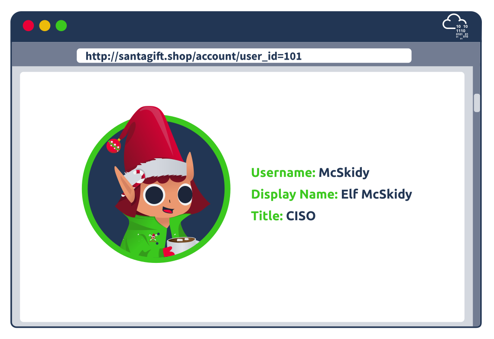
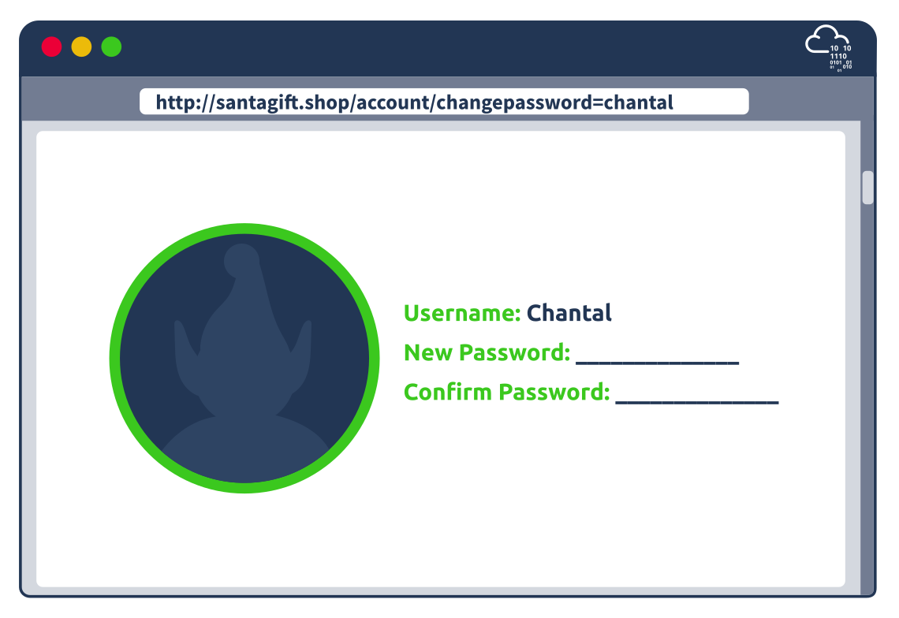
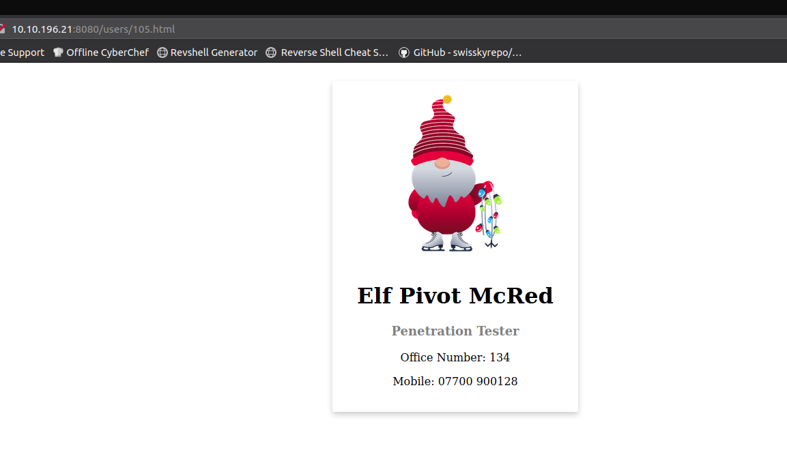

# The Story

Check out Phillip Wylie's video walkthrough for Day 14 [here](https://www.youtube.com/watch?v=UlvYi7ae0G8)!

Elf McSkidy was sipping her coffee when she saw on her calendar that it was time to review the web application’s security. An internal web application is being developed to be used internally and manage the cyber security team. She calls Elf Exploit McRed and asks him to check the in-development web application for common vulnerabilities. Elf Exploit McRed discovers that the local web application suffers from an Insecure Direct Object References (IDOR) vulnerability.

# Learning Objectives
- Web Applications
- The Open Web Application Security Project (OWASP) Top 10
- IDOR

# Web Application
A web application is a piece of software that we can use via a web browser. Unlike computer programs and smartphone applications, a web application does not require any installation on the user’s system to make use of it. To use a web application, we only need a web browser, such as Firefox, MS Edge, Google Chrome, or Safari.

There are many advantages for the user. Because it only needs a web browser, a user can access a web application from a Microsoft Windows system, a Mac computer, or a Linux system. If the user can use a modern web browser, they can access the web application. They will be able to see the same interface and enjoy a very similar experience even with different systems. They can even access the same web application from a web browser on their smartphones, and their experience would only be affected by the screen size and what it can hold.

Moreover, there are many advantages for the software developer. Instead of developing an application for macOS, another for MS Windows, and a third for ChromeOS, they only need to build one web application and ensure that it is compatible with the different modern browsers.

The following are some examples of popular web applications:
- **Webmail**: Examples include Tutanota, ProtonMail, StartMail, and Gmail.
- **Online Shopping**: Some examples are Etsy, Amazon, eBay, and AliExpress.
- **Online Banking**: Modern banks increasingly allow clients to carry out their banking operations from a web browser.
- **Online Office Suite**: Consider, for instance, Microsoft Office 365, Zoho Office, and Google Drive.

As web technologies advance, the number and types of web applications keep increasing.

# Database
When discussing web applications, it is essential to mention database systems. Many web applications need to access vast amounts of data. Even the most basic online shopping web application requires saving information about available products, customer details, and purchases. We must find a solution to hold such information and to read from and write to the existing data efficiently. The answer lies in using a database system.

There are two popular database models:
- Relational Database: It stores the data in tables. Tables can share information. Consider the basic example with three tables: **products**, **customer_details**, and **purchases**. The **purchases** table would use information from the **products** table.
- Non-Relational Database: It is any database that does not use tables. It might store the data in documents, and graph nodes, among other types.

Generally speaking, a web application needs to constantly query the database, for example, to search for information, add new records, or update existing ones.

# Access Control
Consider the case where you are using an online shop as a customer. After logging in successfully, you should be able to browse the available products and check products’ details and prices, among other things. Depending on the online shop, you might be able to add a question or a review about the product; however, as a customer, you should not be able to change the price or details. That’s due to access control.

Access control is a security element that determines who can access certain information and resources. After authentication (covered in Day 5), access control enforces the appropriate access level. In the online shopping example, a vendor should be able to update the prices or descriptions of their products. However, they should not be able to modify the information related to other vendors. A customer, on the other hand, should be able to view but should not be able to alter the data.

However, due to various programming or design mistakes, access control is sometimes not appropriately imposed.

# Web Application Vulnerabilities
The OWASP was established to improve software security. The OWASP Top 10 list aims to raise awareness regarding common security issues that plague web applications. This list would help software developers avoid common mistakes to build more secure products. Other users, such as penetration testers and bug bounty hunters, can use this list to serve their purposes.

IDOR refers to the situation where a user can manipulate the input to bypass authorization due to poor access control. IDOR was the fourth on the OWASP Top 10 list in 2013 before it was published under Broken Access Control in 2017. To learn more about IDOR, consider the following examples.

Let’s say that a user of ID `132` is directed to the following URL after logging in to the system: `http://santagift.shop/account/user_id=132`. However, they soon discover that they can browse other users’ profiles by changing the `user_id` value from `132` to other values expected to match existing user IDs. Although the system should deny them access to the new URL due to lack of authorization, an IDOR vulnerability will let the user display such unauthorized pages. In the figure below, the user managed to access the user’s account page with ID `101`.

Consider the example where requesting an invoice generates a link similar to this: `http://santagift.shop/invoices?download=115`. To test for vulnerabilities, one would replace `115` with another number, as shown in the image below. The system is vulnerable if it lets them access other users’ invoices.

The impact of an IDOR vulnerability might let you reset the password of another user. For instance, after logging in, a malicious user might start with the URL to change their password and replace their username with that of another user. For example, the attacker would replace their username `yeti` in the URL `http://santagift.shop/account/changepassword=yeti` with another valid username and attempt to change their password, as shown in the figure below. The impact of an IDOR vulnerability can be high.

# Exploiting an IDOR Vulnerability
To start the AttackBox and the attached Virtual Machine (VM), click on the “Start the AttackBox” button and click on the “Start Machine” button. Please give it a couple of minutes so that you can follow along.

On the AttackBox, start the Firefox Browser and open the URL `http://MACHINE_IP:8080`. This link should show you a login page. McSkidy has provided us with the following credentials to test the web application:
- Username: `mcskidy`
- Password: `devtest`

After doing some tests, Elf Exploit McRed was able to find multiple IDOR vulnerabilities. After logging in, a user can access the profile pages of other users. Moreover, files can be accessed by guessing their sequential number.

===============================================================================

# Questions

> What is the office number of Elf Pivot McRed?

    Answer: 134

> Not only profile pages but also stored images are vulnerable. Start with a URL of a valid profile image; what is the hidden flag?

    Answer: THM{CLOSE_THE_DOOR}

> Do you like IDOR? It's an Advent of Cyber classic! If you want more, check out the dedicated [room][1] or the [Corridor][2] challenge. 

    This task has no answer needed.

[1]:https://tryhackme.com/room/idor
[2]:https://tryhackme.com/room/corridor
===============================================================================

To begin, deploy the attackbox and virtual machine, open the firefox on attack-box and navigate to `http://MACHINE_IP:8080`:  

enter the provided credential to login to the website:
- username: **mcskidy**
- password: **devtest**

Exploit the IDOR vulnerability and increasing the perimeter value on the URL by 1, until you reach Elf Pivot McRed:

Right click on the image and click "View Image Info" to get the image URL:

Exploit the IDOR vulnerability by decreasing the perimeter value on the image URL by 1, until you reach the flag:

