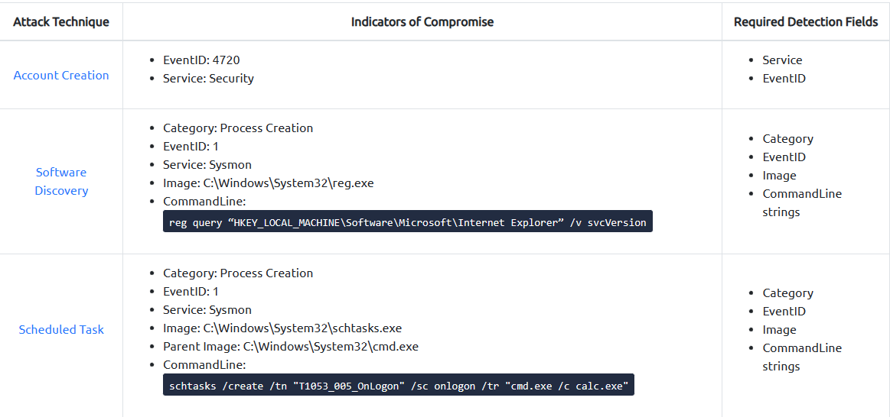
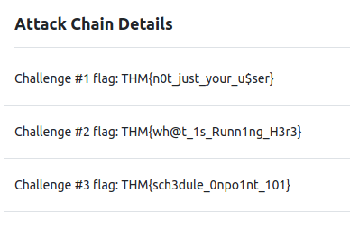
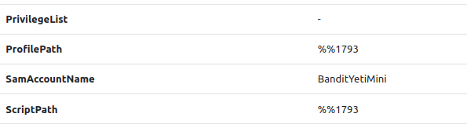
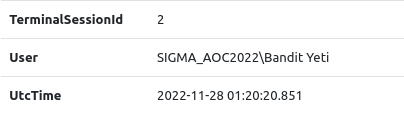
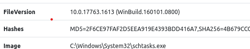

# The Story


Check out Cybrites's video walkthrough for Day 18 [here](https://www.youtube.com/watch?v=4Zqd_FlkEu8)!

Compromise has been confirmed within the Best Festival Company Infrastructure, and tests have been conducted in the last couple of weeks. However, Santa’s SOC team wonders if there are methodologies that would help them perform threat detection faster by analysing the logs they collect. Elf McSkidy is aware of Sigma rules and has tasked you to learn more and experiment with threat detection rules.

# Threat Detection
Cyber threats and criminals have advanced tactics to ensure that they steal information and cause havoc. As you have already seen through the previous days, there are many ways in which this can be done. There are also ways for security teams to prepare their defences and identify these threats. What would be evident is that most of the blue-team activities will require proactive approaches to analysing different logs, malware and network traffic. This brings about the practice of threat detection.

Threat detection involves proactively pursuing and analysing abnormal activity within an ecosystem to identify malicious signs of compromise or intrusion within a network.

# Attack Scenario
Elf McBlue obtained logs and information concerning the attack on the Best Festival Company by the Bandit Yeti. Through the various analysis of the previous days, it was clear that the logs pointed to a likely attack chain that the adversary may have followed and can be mapped to the Unified Kill Chain. Among the known phases of the UKC that were observed include the following:

- **Persistence**: The adversary established persistence by creating a local user account they could use during their attack.
- **Discovery**: The adversary sought to gather information about their target by running commands to learn about the processes and software on Santa’s devices to search for potential vulnerabilities.
- **Execution**: Scheduled jobs were created to provide an initial means of executing malicious code. This may also provide them with persistence or be part of elevating their privileges. 

The attack chain report included indicators of compromise (IOCs) and necessary detection parameters, as listed below. Additionally, the attack techniques have been linked to the MITRE ATT&CK framework for further reading.



[Account Creation][1]  
[Software Discovery][2]  
[Scheduled Task][3]

Before we proceed to the next section, deploy the attached machine and give it up to 5 minutes to launch its services. Once launched, use the AttackBox or VPN to access the link http://MACHINE_IP to our Sigma application, which constitutes the following features:

- **Run** - Submit your Sigma rule and see if it detects the malicious IOC.
- **Text Editor** - Write your Sigma rule in this section.
- **Create Rule** - Create a Sigma rule for the malicious IOC.
- **View Log** - View the log details associated with the malicious IOC.

# Chopping Logs with Sigma Rules
Sigma is an open-source generic signature language developed by Florian Roth & Thomas Patzke to describe log events in a structured format. The format involves using a markup language called [YAML](http://yaml.org/), a designed syntax that allows for quick sharing of detection methods by security analysts. The common factors to note about YAML files include the following:
- YAML is case-sensitive.
- Files should have the `.yml` extension.
- Spaces are used for indentation and not tabs.
- Comments are attributed using the #`character.
- Key-value pairs are denoted using the colon `:` character.
- Array elements are denoted using the dash `-` character.

Sigma makes it easy to perform content matching based on collected logs to raise threat alerts for analysts to investigate. Log files are usually collected and stored in a database or a Security Information and Event Management (SIEM) solution for further analysis. Sigma is vendor-agnostic; therefore, the rules can be converted to a format that fits the target SIEM.

Sigma was developed to satisfy the following scenarios:
- To make detection methods and signatures shareable alongside IOCs and Yara rules.
- To write SIEM searches that avoid vendor lock-in.
- To share signatures with threat intelligence communities.
- To write custom detection rules for malicious behaviour based on specific conditions.

# Sigma Rule Syntax

Sigma rules are guided by a given order of required/optional fields and values that create the structure for mapping needed queries. The attached image provides a skeletal view of a Sigma rule.


Let’s use the first attack step challenge to define the syntax requirements, fill in the details into our skeletal rule, and detect the creation of local accounts. Use the text editor section of the SigHunt application to follow along.

- **Title**: Names the rule based on what it is supposed to detect.
- **ID**: A globally unique identifier that the developers of Sigma mainly use to maintain the order of identification for the rules submitted to the public repository, found in UUID format.
- **Status**: Describes the stage in which the rule maturity is at while in use. There are five declared statuses that you can use:
> 1. *Stable*: The rule may be used in production environments and dashboards.
> 2. *Test*: Trials are being done to the rule and could require fine-tuning.
> 3. *Experimental*: The rule is very generic and is being tested. It could lead to false results, be noisy, and identify exciting events.
> 4. *Deprecated*: The rule has been replaced and would no longer yield accurate results. 
> 5. *Unsupported*: The rule is not usable in its current state (unique correlation log, homemade fields).

- **Description**: Provides more context about the rule and its intended purpose. Here, you can be as detailed as possible to provide information about the detected activity.

```
title: Suspicious Local Account Creation
id: 0f06a3a5-6a09-413f-8743-e6cf35561297 
status: experimental
description: Detects the creation of a local user account on a computer.
```

- **Logsource**: Describes the log data to be used for the detection. It consists of other optional attributes:
> 1. Product: Selects all log outputs of a certain product. Examples are Windows, Apache
> 2. Category: Selects the log files written by the selected product. Examples are firewalls, web, and antivirus.
> 3. Service: Selects only a subset of the logs. Examples are sshd on Linux or Security on Windows.
> 4. Definition: Describes the log source and its applied configurations.

```
logsource:
product: windows
service: security
```

**Detection**:  A required field in the detection rule describes the parameters of the malicious activity we need an alert for. The parameters are divided into two main parts:
> 1. The search identifiers are the fields and values the detection should search for.
> 2. The condition expression - sets the action to be taken on the detection, such as selection or filtering. The critical thing to look out for account creation on Windows is the Event ID associated with user accounts. In this case, Event ID: 4720 was provided for us on the IOC list, which will be our search identifier.

```
detection:
  selection:
    EventID:  # This shows the search identifier value
      - 4720    # This shows the search's list value
  condition: selection
```

The search identifiers can be enhanced using different modifiers appended to the field name with the pipe character `|`. The main type of modifiers are known as **Transformation modifiers** and comprise the values: contains, endswith, startswith, and all. Some of these modifiers will be vital in writing rules against the other IOCs.

```
detection:
  selection:
    Image|endswith:
      - '\svchost.exe'
    CommandLine|contains|all: 
      - bash.exe
      - '-c '   
  condition: selection
```
- **FalsePositives**: A list of known false positives that may occur based on log data.
- **Level**: Describes the severity with which the security team should take the activity under the written rule. The attribute comprises five levels: Informational -> Low -> Medium -> High -> Critical
- **Tags**: Adds information that can be used to categorise the rule. Common tags are associated with tactics and techniques from the MITRE ATT&CK framework. Sigma developers have defined a list of [predefined tags][4].

```
falsepositives: 
    - unknown
level: low
tags:
   - attack.persistence # Points to the MITRE Tactic
   - attack.T1136.001 # Points to the MITRE Technique
```

Voila!! We have written our first Sigma rule and can run it on the AoC Sigma Hunting application to see if we can get a match. As mentioned before, Sigma rules are converted to fit the desired SIEM query, and in our case, it should be known that they are being transformed into Elastic Queries on the backend. Various resources perform this task, with the native tool being [Sigmac][5], which is being deprecated and replaced with a more stable python library, [pySigma][6]. Another notable tool to check out is [Uncoder.io][7]. Uncoder.IO is an open-source web Sigma converter for numerous SIEM and EDR platforms. It is easy to use as it allows you to copy your Sigma rule on the platform and select your preferred backend application for translation.

# Activity
Equipped with the knowledge about Sigma rules, your task is to complete the remaining two challenges by writing rules corresponding to the attack chain phases and IOCs. Santa is relying on you to beef up his security against adversaries attempting to stop Christmas this year. As a reminder, the required fields for the attacks are below:
- **Software Discovery**: Category, EventID, Image, CommandLine.
- **Scheduled Jobs**: Category, EventID, Image, CommandLine.


[1]:https://attack.mitre.org/techniques/T1136/
[2]:https://attack.mitre.org/techniques/T1518/
[3]:https://attack.mitre.org/techniques/T1053/005/
[4]:https://github.com/SigmaHQ/sigma/wiki/Tags
[5]:https://github.com/SigmaHQ/sigma/blob/master/tools/README.md
[6]:https://github.com/SigmaHQ/pySigma
[7]:https://uncoder.io/

===============================================================================

# Questions

> What is the Challenge #1 flag?

    Answer: THM{n0t_just_your_u$ser}

> From the Challenge 1 log, what user account was created?

    Answer: BanditYetiMini

> What is the Challenge #2 flag?

    Answer: THM{wh@t_1s_Runn1ng_H3r3}

> What was the User's path in the Challenge #2 log file?

    Answer: SIGMA_AOC2022\Bandit Yeti

> What is the Challenge #3 flag?

    Answer: THM{sch3dule_0npo1nt_101}

> What was the MD5 hash associated with Challenge #3 logs?

    Answer: 2F6CE97FAF2D5EEA919E4393BDD416A7

> Did you like learning about detection? Check out the [Yara][8] room to learn more!  

    This task has no answer needed.

[8]:https://tryhackme.com/room/yara

===============================================================================

To begin, deploy the virtual machine and the attack-box.

Open the attack-box and navigate to http://MACHINE_IP.

## Challenge Flags



## Sigma rule for Flag #1

```
title: Suspicious Local Account Creation
id: 0f06a3a5-6a09-413f-8743-e6cf35561297
status: experimental
description: Detects the creation of a local user account on a computer

logsource:
  product: windows
  service: security
detection:
  selection:
    EventID:
      - 4720
  condition: selection
    
falsepositives:
  - unknown

level: low
tags:
  - attack.persistence
  - attack.T1136.001
```

View log to see the user account created.



## Sigma rule for Flag #2

```
title: Suspicious Software Discovery
id: 
status: experimental
description: Discover new software on a computer

logsource:
  product: windows
  service: sysmon
  category: process_creation
detection:
  selection:
    EventID:
      - 1
    Image|endswith:
      - reg.exe
    CommandLine|contains|all:
      - reg
      - query
      - /v
      - svcVersion
  condition: selection
    
falsepositives:
  - unknown
```

View log to see the user's path:



## Sigma rule for Flag #3

```
title: Scheduled Task
id: 
status: experimental
description: Discover new software on a computer

logsource:
  product: windows
  service: sysmon
  category: process_creation
detection:
  selection:
    EventID:
      - 1
    Image|endswith:
      - schtasks.exe
    CommandLine|contains|all:
      - schtasks
      - /create
  condition: selection
    
falsepositives:
  - unknown
```

View log to see the MD5 hash:




