# The Story

Check out John Hammond's video walkthrough for Day 19 [here](https://www.youtube.com/watch?v=HE12-x7E7lc)!

# Spying on Santa

Elf McSkidy was doing a regular sweep of Santa's workshop when he discovered a hardware implant! The implant has a web camera attached to a microprocessor and another chip. It seems like someone was planning something malicious... We must try to understand what this implant was trying to do! We will deal with the microprocessor and the web camera in future tasks; for now, let's try to uncover what that other chip is being used for.
The VM that we will use in this task takes approximately 8 minutes to start. We suggest that you start the machine now to have it ready by the time you get to the practical element of the task!

# Learning Objectives
- How data is sent via electrical wires in low-level hardware
- Hardware communication protocols
- How to analyse hardware communication protocols
- Reading USART data from a logic capture

# Welcome to the Matrix

Hardware hacking is often shrouded in mystery and seen as a super complex topic. While there are a lot of in-depth complex hardware hacking components, getting our feet wet is actually pretty simple. Computers today are incredibly powerful. This allows them to build additional features and safety measures into their communication protocols to ensure that messages are transmitted reliably. Think about the Transmission Control Protocol (TCP), which has multiple redundancies in place! It even sends three full packets just to start its communication!

In the world of microchips, we often don't have this luxury. To make sure our communication protocols are efficient as possible, we need to keep them as simple as possible. To do that, we need to enter the world of 0s and 1s. This then begs the question, how does hardware take electricity and generate signals? In this task, we will focus on digital communication. For hardware communication, we use a device called a Logic Analyser to analyse the signals. This device can be connected to the actual electrical wires that are used for communication between two devices that will capture and interpret the signals being sent. In this task, we will use a logic analyser to determine the communication between two devices in the rogue implant.

# The Electrical Heartbeat

Back to our question, if we have electricity, how can we generate a digital signal? The approach most hardware components take is to simply turn the power on and off. If the power is on, we are transmitting a digital 1. If the power is off, we are transmitting a digital 0. We call these 1s and 0s bits. To perform communication, we simply turn the power on and off in a specific sequence to transmit a bunch of 0s and 1s. If we send 8 bits, we are sending a single byte! Voila! We have just performed digital hardware communication! These are the wonderful squiggly lines you would see on a logic analyser:

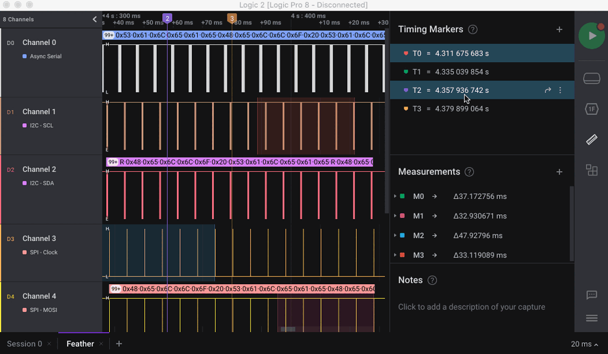

We can transmit text data by using the [ASCII table][1]. Sending the binary representation of each character, we can transmit data! However, it isn't actually just that simple. If we wanted zero effort in our communication, we would need an electrical wire for each 0 or 1 that we wanted to transmit. Considering that a single character is one byte of data (thus 8 electrical wires), this can become a mess of wires really fast! To make this more efficient, we need to use fewer wires and then have both hardware chips agree to a specific digital protocol and configuration that will be used to transmit data. Let's look at some of the most common protocols and how they work to send data still while reducing the number of wires we need.

# USART

Universal Synchronous/Asynchronous Receiver-Transmitter (USART) communication, or as it is better known, serial communication, is a protocol that uses two wires. One wire is used to transmit (TX) data from device A to device B, and the other wire is used to receive (RX) data on device A from device B. In essence, we connect the transmit port from one device to the receive port from the other device and vice versa.

What is interesting about this protocol is that there is no clock line that synchronises the communication of the devices. Without a clock, the devices have to agree to the configuration of communication, such as the following:
- Communication speed - This is also called the baud rate or bit rate and dictates how fast bytes of data can be sent. Agreeing to a specific rate tells each device how fast it should sample the data to get accurate communication. While there are fixed standards for baud rates, devices can choose to use any other rate as long as both devices support it.
- Bits per transmission - This is normally set to 8 bits which makes a byte, but it can be configured to something else, such as 16 bits.
- Stop and Start bits - Since there is no clock, one device has to send a signal to the other device before it can send or end a data transmission. The configuration of the start and stop bits dictate how this is done.
- Parity bits - Since there can be errors in the communication, parity bits can be used to detect and correct such errors in the transmission.

Once the two devices agree on the configuration of the serial lines, they can now communicate with each other. A single transmission is shown in the diagram below on how the ASCII character of "S" would be transmitted:

There are a couple of caveats, however. The devices don't really have a way to determine if the other device is ready for communication. To solve this, some USART connections will use two additional lines called Clear To Send (CTS) and Request to Send (RTS) to communicate to the other device whether it is ready to receive or ready to transmit. Furthermore, to agree upon what voltage level is a binary 1 or 0, a third wire called the Ground (GND) wire is required to allow the devices to have the same voltage reference.

However, despite all of this, USART is an incredibly popular protocol in microprocessors due to its simplicity.

# SPI

The Serial Peripheral Interface (SPI) communication protocol is mainly used for communication between microprocessors and small peripherals such as a sensor or an SD card. While USART communication has the clock built into the TX and RX lines, SPI uses a separate clock wire. Separating the clock (SCK) from the data (DATA) line allows for synchronous communication, which is faster and more reliable. So the trade-off is adding an additional wire, but we gain a speed and reliability boost. An example of the same "S" being transmitted using SPI is shown below:

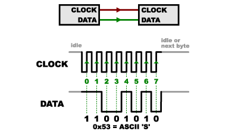

The clock line tells the receiving device exactly when it needs to read the data line. Two-way communication is also possible, but quite a bit more complex than serial communication. Essentially, one of the devices is labelled the controller. This is the only device that is allowed to send clock signals. All other devices become secondary devices that must follow the controller's clock signal to transmit data back. If two-way communication is used, instead of having a single data line, two lines are used, namely Peripheral-In Controller-Out (PICO), which means communication is sent from the controller, and Peripheral-Out Controller-In (POCI), which means communication is sent from the secondary device back to the controller. Using this, the controller sends a clock signal and a command out to the device using the PICO line and then keeping the clock signal, the controller receives data back on the POCI line, as shown in the diagram below:

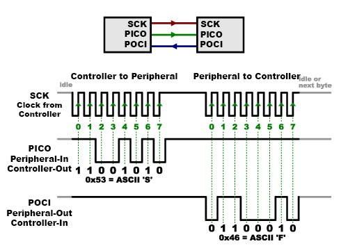

There is one additional change that can be made. While there can only be one controller, there can be multiple secondary devices. To save wires and ports, all devices can use the same SCK, PICO, and POCI lines. A fourth wire, called the Chip Select (CS) wire, is used to distinguish the device that the communication is meant for. The controller can use this line to indicate to the specific device that it wants to communicate to it, as shown in the diagram below:

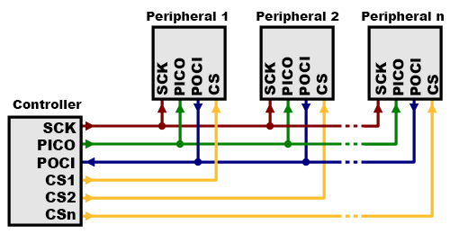

SPI communication is a fair bit more complex than USART, but having a dedicated clock line increases the speed at which we can communicate and improves reliability.

# I2C

The Inter-Integrated Circuit (I2C) communication protocol was created to deal with the drawbacks of both the USART and SPI communication protocols. Because USART is asynchronous and has the clock built into the transmit and receive lines, devices have to agree ahead of time on the configuration of communication. Furthermore, speeds are reduced to ensure communication remains reliable. On the other hand, while SPI is faster and more reliable, it requires many more wires for communication, and every single additional peripheral requires one more Chip Select wire.

I2C attempts to solve these problems. Similar to USART, I2C only makes use of two lines for communication. I2C uses a Serial Data (SDA) line and Serial Clock (SCL) line for communication. However, instead of using a Chip Select wire to determine which peripheral is being communicated to, I2C uses an Address signal that is sent on the SDA wire. This Address tells all controllers and peripherals which device is trying to communicate and to which device it is trying to communicate to. Once the signal is sent, a Data signal can be used to send the actual communication. To notify other controllers and peripherals that communication is taking place and prevent these devices from talking over each other, a Start and Stop signal is used. Each device can monitor these Start and Stop signals to determine if the lines are busy with communication. An example of such a data transmission is shown below:

Since an external clock line is used, communication is still faster and more reliable than USART, and while it is slightly slower than SPI, the use of the Address signal means up to 1008 devices can be connected to the same two lines and will be able to communicate. Now that we understand the basics of hardware communication protocols, we can look to analyse the logic of that rogue implant!

# Probing the Logic

After sending this rogue implant to the forensic lab for analysis, the following circuit diagram is uncovered:

Based on the diagram, it seems like there is a microprocessor that is connected to an ESP32 chip. Doing some research, we can see that the ESP32 chips allow microprocessors to communicate over WiFi and Mobile networks. So whatever this implant was doing, it was definitely communicating with someone else. If we can intercept the communication between the microprocessor and the ESP32 chip, we would be able to see what commands and information are being sent. It seems like the perfect opportunity for our red and blue team to team up! Elf Forensic and Elf Recon are on the job!

The elves realise that these chips probably use digital communication that can be intercepted with a Logic Analyser. Looking at the wires between the chips, we see a black wire connected to a pin called GND and a red wire connected to a pin called VIN. Elf Forensic knows from experience that this would be the Ground and Voltage IN wires, respectively, meaning these wires are used to provide power to the chip. That then leaves the green and purple wires that would be used for data transmission. Seeing that they are connected to the RX0 and TX0 pins, Elf Recon can deduce that this refers to the Transmit and Receive lines of USART communication. Hence we are pretty sure that the protocol used for communication is USART. Armed with this information, the elves connect the probes of the Logic Analyser to the green and purple wires before powering on the implant. Immediately, super-fast signals are seen on the analyser! The elves create a logic data dump from the signals, and McSkidy is asking you to investigate what is actually being transmitted!

# Analysing the Logic

In order to analyse the logic data dump, we will need to use a logic analyser tool called [Saleae][2]. Start the machine attached to this task (if you have not already) which will open an in-browser Windows machine where all the required tools have already been installed for you. Once the machine is loaded on the Desktop, double-click the Logic 2 application. Once loaded, you should see this screen:

Let's import the logic data dump to start our analyser. Select the Open a Capture option and select the `santa` file that is on the Desktop and click Open:

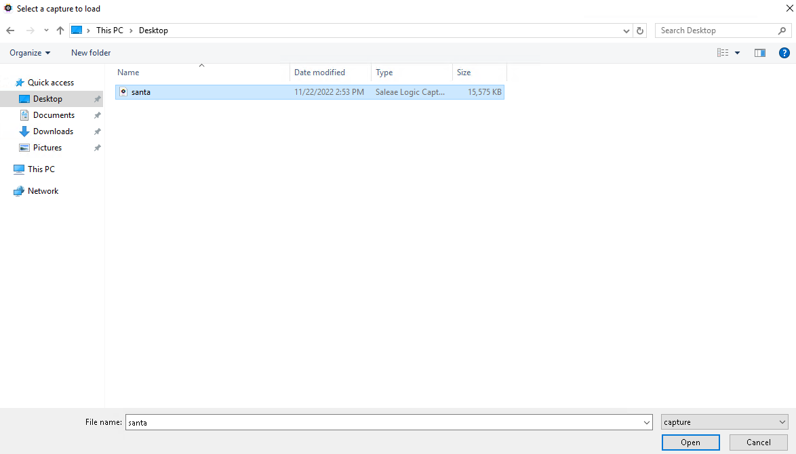

You can ignore the calibration error popup. Once loaded, you should be able to see the captures. If you hold Left-Ctrl and use the mouse wheel to zoom out a bit (or you can click on View->X Zoom Out), you should be able to see the digital signals:

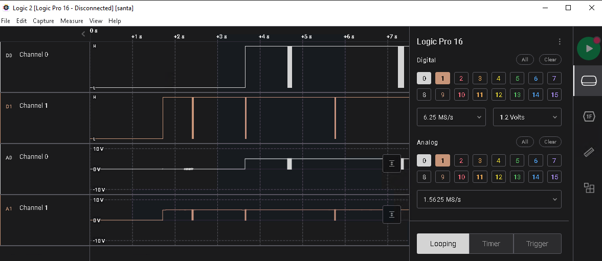

D0 and D1 refer to the digital channels of the two lines that were probed. A0 and A1 refer to the analogue data from the probers. Hover your mouse over the first thick line on D1 channel 1 and use Left-Ctrl and the mouse wheel to zoom in again; you should be able to see the entire signal transfer:

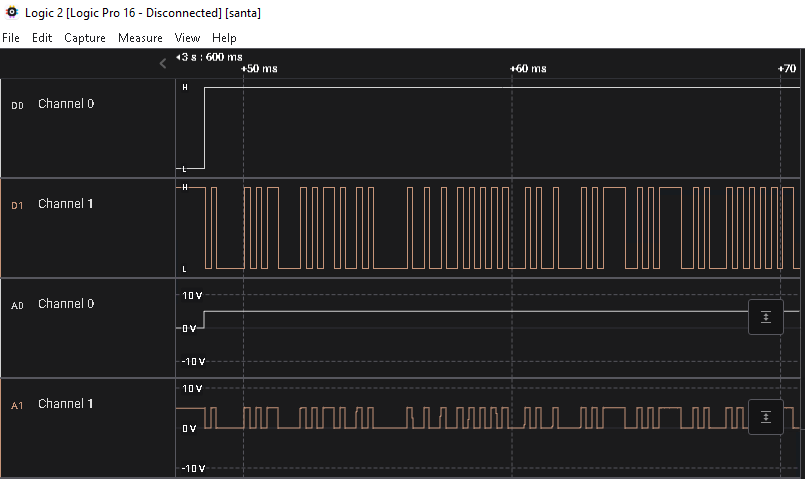

What is very interesting from this screen is that you can see how the analogue voltage data corresponds to the digital signal that is seen. Looking at the A1 Channel 1 vs D1 Channel 1, you can see that there are slight breaks in the analogue data that have been corrected in the digital channel. Now that we can see the digital signal data, we can look to use a logic analyser to read the contents of the data. Click on the Analyzers tab to the right:

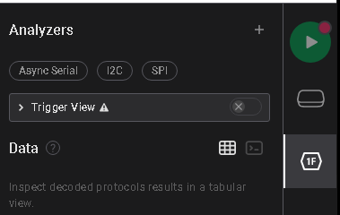

Since we know the protocol is USART, let's look to configure an Async Serial analyser for both Channel 1 and 0. Let's configure Channel 1's analyser first. If we were true hardware reverse engineers, we would first have to figure out the rate at which data is being transmitted as well as the specific configuration such as parity bits and frames. However, to keep this simple Forensic Elf has already discovered this for you. Alter your configuration to match the following and click Save:

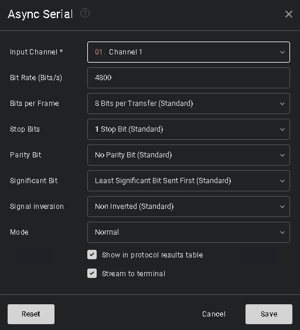

Once saved, we can see that the data is being analysed. Click the little terminal Icon, and we can actually read the data being transmitted!

We see the initialisation sequence of the serial line and then three lines of data being sent:
- ACK REBOOT
- CMDX195837
- 9600

This doesn't yet mean anything since we are only seeing one side of the data. In order to see the other messages, we need to add another analyser to Channel 0. Click the plus icon next to Analysers and add another Async Serial analyser with the same configuration, except for Channel 0:

Once added, click the Trash icon in the bottom right to remove all terminal data. Once done, click on the three dots next to each analyser and select Restart on both of them. Your terminal should now look something like this:

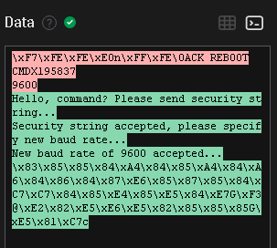

Now we are starting to piece together the information! It seems like the microprocessor is establishing a session with the ESP32 device to allow communication to the control server! We can now see the full discussion between the two devices. The processor asks the ESP32 to reboot its connection to the control server. The ESP32 is happy to oblige but requests a security code to be sent to allow connection to the control server. Once the security code has been transmitted, the ESP32 allows the microprocessor to negotiate a new baud rate to be used for communication. Interestingly, once this new baud rate is accepted, we cannot read the rest of the output! However, since we intercepted the baud rate, we can simply edit our Channel 0 analyser to a new baud rate to read the rest of the communication that was sent. Go make this change to get your flag!

This is excellent progress! We were able to read the initial communication between these two devices that were used to establish a connection to the control server. Now that we have this information, we can keep monitoring the lines and analysing the logic to see any messages that are sent. We are one step closer to knowing who is responsible for this rogue implant!

[1]:https://www.asciitable.com/
[2]:https://www.saleae.com/

===============================================================================

# Questions

> What device can be used to probe the signals being sent on electrical wires between two devices?

    Answer: logic analyser

> USART is faster than SPI for communication? (Yea,Nay)

    Answer: Nay

> USART communication uses fewer wires than SPI? (Yea,Nay)

    Answer: Yea

> USART is faster than I2C for communication? (Yea,Nay)

    Answer: Nay

> I2C uses more wires than SPI for communication? (Yea,Nay)

    Answer: Nay

> SPI is faster than I2C for communication? (Yea,Nay)

    Answer: Yea

> What is the maximum number of devices that can be connected on a single pair of I2C lines?

    Answer: 1008

> What is the new baud rate that is negotiated between the microprocessor and ESP32 chip?

    Answer: 9600

> What is the flag that is transmitted once the new baud rate was accepted?

    Answer: THM{Hacking.Hardware.Is.Fun}

> Looking for a challenge? Try our [Recent Threats][3] module! 

    This task has no answer needed.

[3]:https://tryhackme.com/module/recent-threats

===============================================================================

To begin, deploy the virtual machine. Then double-click the `Logic 2.x.x` application and follow the walkthrough to import the logic data dump to start analysis.

Open Analyzers on the right tab, and configure the **Async Serial** configuration as provided in walkthrough.

Most Yea/Nay questions can be answered by following the walkthrough above.

By configuring the Async Serials analysers on both Channel 0 and 1, you can find the new baud rate communicated:

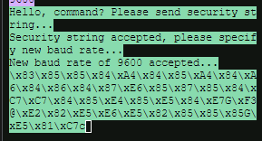

Given the new baud rate communicated, re-edit both analysers to listen on 9600 Bits/s and restart the analysis again.

Clear the data and restart the analyzers to get the flag:

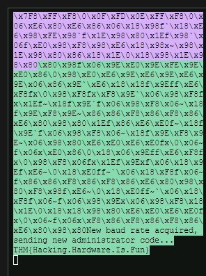
