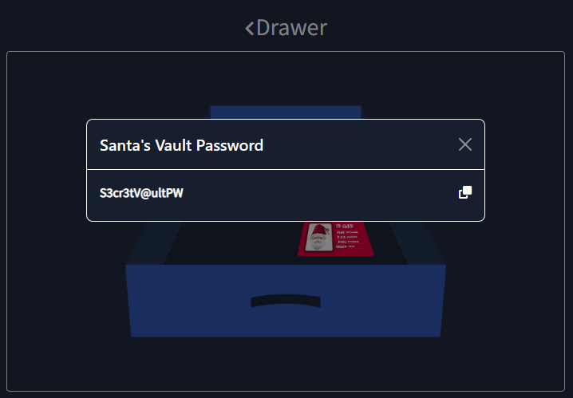
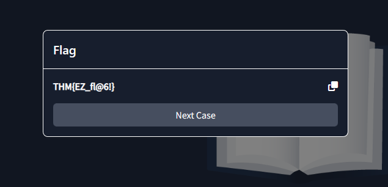
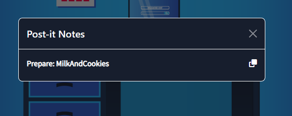
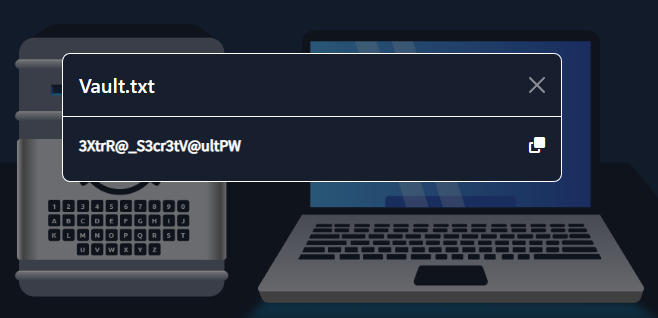
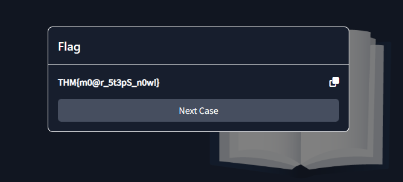
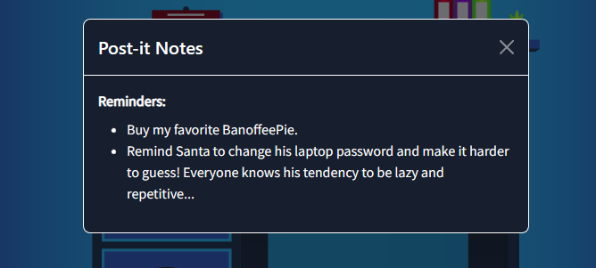
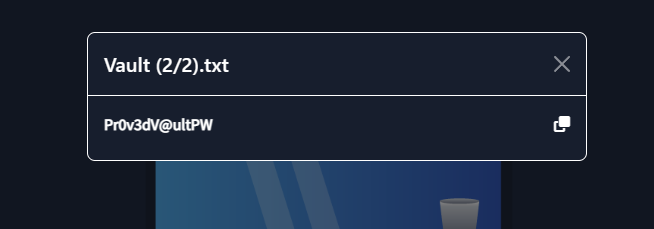
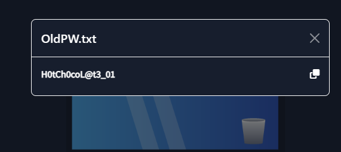
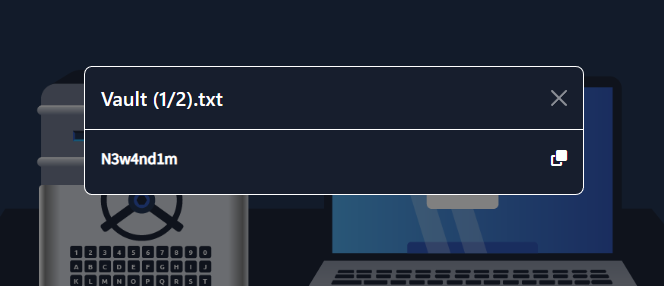
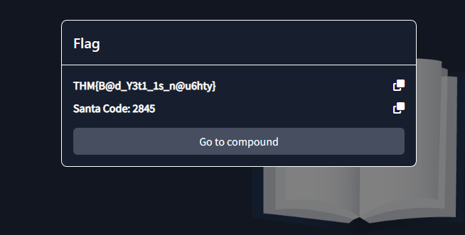

# The Story

Check out Marc's video walkthrough for Day 23 [here](https://youtu.be/eib8zGMTook)!

Every effort you have put through builds on top of each other to bring you right at this moment. Santa and the security team are so proud of you for sticking around and being with us until now. You’re practically a member of the SSOC team already! There’s just one more thing left to learn: a lesson that may completely change how you look at and approach security.

Throughout all the previous tasks, layering defenses and reducing attack surfaces have been touched upon at least once. Writing secure code and being able to respond and analyse different parts of the attack chain, among others, are all essential in maintaining Santa's Security Posture defensible. In this task, we will focus on what is formally known in security circles as Defense in Depth, which is a more general and encompassing topic than the prior ones on their own.

# Core Mindset

The core mindset that Defense in Depth is founded on is the idea that there is no such thing as a silver bullet that would defeat all of an organisation’s security woes. No single defence mechanism can protect you from the bad world out there.

# Contrasting the Past and the Modern Takes on Defensive Security

Castle walls are built to withstand sieges and barrages and are fortified and manned well to protect from pillagers and marauders. Yet despite all this effort and diligence at maintaining and protecting this security measure, attackers will breach it sooner or later, and depending on the defenders' response within the castle walls, may mark the start of their end.

For the longest time, and maybe even until today, a lot of organisations have looked at their security posture in the same way medieval lords did: a strong focus on securing the castle walls - the perimeter, so to speak. However, like medieval lords, after the perimeter is breached and depending on the organisation’s response, it’s pretty much done for them too.

Fret not, though! Modern defensive security teams are moving on from this mindset and are shifting to a more robust approach. Being mindful that the castle wall, while important, is not the only way to secure the organisation, acknowledging the reality that at some point, gunpowder will be discovered and a single point of failure consequently exploited, and having additional defensive layers, especially for the specific crown jewels that the bad guys may be targeting - these are some of the foundations that make up the modern security posture of defensible organisations.

# Disrupting Adversarial Objectives

Defense in Depth is mainly focused on disrupting adversarial objectives; that is, the shift of focus from ‘just’ securing the perimeter to securing everything in the path that the adversary will have to take from the perimeter to the crown jewels.

Let’s look at it at three varying levels of defense:
1. The first level is having a focus on perimeter security. There are great prevention mechanisms present in the perimeter and essentially complete trust within it; thus, once the perimeter is bypassed, the organisation is pretty much at the mercy of the adversary.
2. The second level has defensive layers in place; however, the emphasis is solely on prevention. It doesn’t leverage ‘knowing your environment’; even though adversarial objectives may be prevented to some degree, there’s a missed opportunity in terms of detection and consequently, alerting and response. Prevention is good, but the key to defeating the bad guys is having visibility into what they are doing.
3. The third level has well-rounded defensive layers in place, leveraging the strategic application of sensors, effective creation of analytics, and efficient alerting and response capabilities of the security team. Preventative measures here are not only coupled by detection and alerting but also by immediate and efficient response.

The first level above can be thought of as an organisation that employs great perimeter defenses in place, such as Web Application Firewalls (WAFs), Perimeter Network Firewalls, and even a Demilitarized Zone (DMZ), but is yet to implement internal network security, and zero trust mechanisms are not yet in place.

The second level can be thought of as an organisation that employs the first level of defenses but with more capable internal security measures, such as network segmentation, zero trust principle implementation, least privileged access principle implementation, and even hardened hosts and networks. Having this level is actually really good; however, forgetting that preventative appliances may be used for detective capabilities, too, is a wasted opportunity.

The third level can be thought of as using the advantages of the first and second levels to ramp up the detection and response capability of the organisation via effective log collection and well-crafted analytics. This is where it goes full circle. We are not only expected to be good at layering preventive measures against attacks, but we should also be capable of responding to them if and when these defensive capabilities are bypassed.

Let’s have the following scenario as an example: let’s say an adversary was able to penetrate our perimeter defenses via a successful spear phishing campaign. He would need to navigate a hardened environment full of tripwires and traps.

He may be able to take over a specific user’s account, but since we have implemented the principle of least privilege access properly, he would be limited in terms of what he can work with. He may be able to move laterally to another user with better privileges via pass-the-hash. Still, since we have good logging mechanisms and detection capabilities, our analytics would know exactly what pass-the-hash looks like, so we will pick this activity up. Our cavalry will be alerted to respond and remediate this particular breach immediately.

Remember that the main difference between levels 2 and 3 is the jiving together of these defensive layers and detection and response mechanisms, allowing for a coherent and well-rounded security posture.

A goal of layering defenses is to limit the room for mistakes that an adversary can have. In that sense, the bad guys need to get everything correct, but we only need them to make a mistake once.

To drive this point home, we will explore what it’s like to be in the bad guy’s shoes.

We have prepared a little game for you. The game's objective is simple: get your hands on the Naughty or Nice list in Santa’s vault. There will be three levels; each consequent one builds a defensive layer on top of the previous one and will be a little bit harder. Remember that you’re playing as the Bad Yeti here, so make sure you don’t get caught!

Click the **View Site** button at the top of the task to launch the static site.

# Game summary / post-game discussion

After completing the game and experiencing the different levels of difficulty that an adversary may face when layering defensive measures, it must be clear to you by now that layering defenses is cool!

The levels of the game are an analogy to the three varying levels of defenses discussed earlier in this task. Further, the attack chain within the game can be interpreted as follows: Santa’s Executive Assistant (EA) receives a spear phishing email. Upon establishing a foothold, the Bad Yeti immediately realises that the EA doesn’t have access to the Naughty or Nice list. So after some enumeration and even assuming Santa’s identity at one point, the Bad Yeti was able to get ahold of the coveted list and actually ruin Christmas. Good thing it was just a game!

While the reason behind it is to show the varying effects of having defensive layers from the bad guy's perspective, on the flip side, the reality of implementing it for defensive security teams is more iterative and cyclic. Breaches and true-positive detections show areas that require improvement and the extent of our visibility in the organisation, respectively. Attacks, whether or not successful, should further inform defensive steps and approaches. If we learned that an adversary was able to exploit a specific vulnerability, then rest assured that the vulnerability will be patched and the application introducing it will be hardened.

# Summary and Conclusion

Modern security practices are composed of layers. Stopping attacks from the get-go is very helpful - ideal even, but it’s not always possible. Everyone can and will be compromised - it’s just a matter of when, and it’s up to every one of us to disrupt them from being able to do what they intend to do and in every step of the way.

===============================================================================

# Questions

> Case 1: What is the password for Santa’s Vault?

    Answer: S3cr3tV@ultPW

> Case 1: What is the Flag?

    Answer: THM{EZ_fl@6!}

> Case 2: What is Santa’s favourite thing?

    Answer: MilkAndCookies

> Case 2: What is the password for Santa’s Vault?

    Answer: 3XtrR@_S3cr3tV@ultPW

> Case 2: What is the Flag?

    Answer: THM{m0@r_5t3pS_n0w!}

> Case 3: What is the Executive Assistant’s favourite thing?

    Answer: BanoffeePie

> Case 3: What is Santa’s previous password?

    Answer: H0tCh0coL@t3_01

> Case 3: What is Santa’s current password?

    Answer: H0tCh0coL@t3_02

> Case 3: What is the 1st part of the vault’s password?

    Answer: N3w4nd1m

> Case 3: What is the 2nd part of the vault’s password?

    Answer: Pr0v3dV@ultPW

> Case 3: What is the password for Santa’s Vault?

    Answer: N3w4nd1mPr0v3dV@ultPW

> Case 3: What is the Flag?

    Answer: THM{B@d_Y3t1_1s_n@u6hty}

> What is Santa's Code?

    Answer: 2845

> Mission ELFPossible: What is the Abominable for a Day Flag?

    Answer: THM{D3f3n5e_1n_D3pth_1s_k00L!!}

> If you'd like to learn more about mitigating and managing potential adversary actions, check out the [Threat Intelligence][1] module! 

    This task has no answer needed.

[1]:https://tryhackme.com/module/cyber-threat-intelligence

===============================================================================

To begin, click on **View Site**.

Click on **Start** to begin the game.

## Case 1

Click on the Elf guard and choose any option since the guard does not really care. Then click on the **gate** to proceed

Click bottom right house to visit EA's office. Then click on the top drawer below the desk, and then click on the white notepad to get the Santa Vault's password.

Go back out to compound, and click on Santa's office (top right).  
Then select the vault and enter the password to get the *Naughty or Nice* list.

## Case 2

Click on the Elf guard, this time select "Delivery for Santa's EA" as the other options won't work. Then click on the **gate** to proceed.  
Click bottom right house to visit EA's office. Then click the mug to read the Post-it Notes:

The note should be Santa's favorite thing. Go back to the compount and enter Santa's office (top right).  
Click on the laptop and enter value from Postit Note to unlock the laptop.  
Click the **TXT** file on the laptop to get the vault password:

Click on the vault and enter the vault password to get the *Naughty or Nice* list.

## Case 3

Click on the Elf guard, this time select "Delivery for Santa's EA" as the other options won't work. Then click on the **gate** to proceed.  
Click bottom right house to visit EA's office. and click the mug to get some post-it notes information:

Click the top drawer to get Santa's pass which gives access to Santa's office:

Click the laptop and enter EA's favorite which is found on the post-it. Then click the **TXT** file to find part 2 of the vault's password:

Click the recycle bin on the laptop to find Santa's old password:

Go back to the compount and enter Santa's office (top right).  
Click on Santa's laptop and enter the password, which is similar to the old password but change the last digit to a **2**:  
`H0tCh0coL@t3_02` -- because Santa is lazy and cannot remember big password changes.  
Then click the **TXT** file to get part 1 of the vault password.

Click the vault and combine both parts of the vault password to open it. Then click the mug to read the Post-it Notes:

Go back to compount and proceed to Santa's Workshop (top left).  
Use the code to enter the workshop to get the last flag:  

