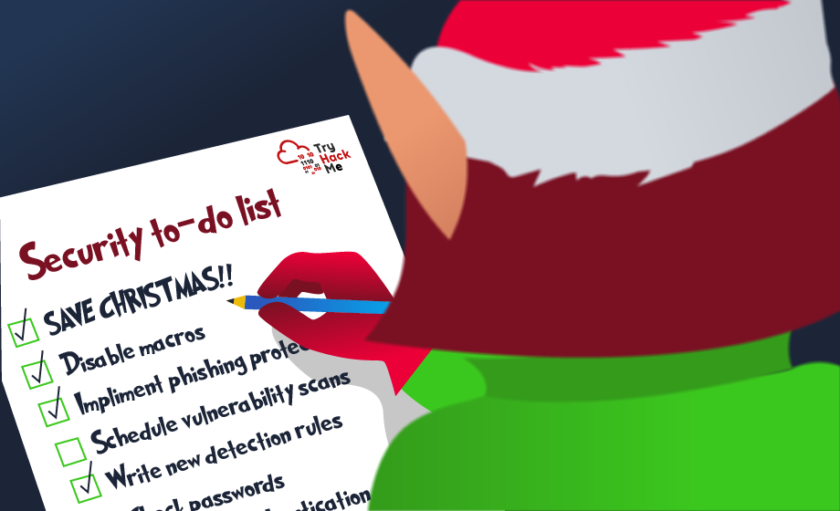

# [Nightmare Before Elfmas - The End]

Ah, what a month! As McSkidy watched Santa’s sleigh take off, loaded with gifts, she sighed with relief.  
We did it! 

Looking around the workshop, she could see Santa’s SOC Team working on their tasks.  
Some were setting up additional defenses, some were implementing new security policies,  
and some were trying out new skills (and hats!) too.

There are some things McSkidy can’t see, but would be vital for you to know. 

If we could look inside his planning room, we’d see the beginnings  
of a new scheme, but let’s not worry about that today!

As McSkidy returned to her office, she looked at her desk,  
where just 24 days ago, an evil-looking card was placed.  
Now that spot was occupied by a scroll with a massive security to-do list. 

They all worked hard to clear as many items as possible, but many remain.  
Security is never done!

However, with Santa in the air, she could cross out “Save Christmas” off the list. Success!

McSkidy and all the Elves from Santa’s Security Team thank you for your help this year.
They promised to call you if they get into trouble in 2023!

# [The Final Countdown]

You have until the end of December 27th to answer as many questions in this room as possible. Each question answered is an additional ticket in the main prize raffle! We will announce prize winners on December 28th. See the timer below for the exact countdown!

The Advent of Cyber 2022 room will remain available for you to explore. Grab the last question of the event below and get one more raffle ticket! Please note that once all questions in this room are answered, you will receive an Advent of Cyber 2022 badge and certificate. Very cool! **Check your Full Name on your [profile page][1] before generating the Certificate, as it can’t be changed afterwards**.

Happy Holidays,

*The TryHackMe Team*

[1]:https://tryhackme.com/profile

===============================================================================

# Questions

> Are you ready to continue your learning journey on TryHackMe? (Yea,Yea)

    Answer: Yea
